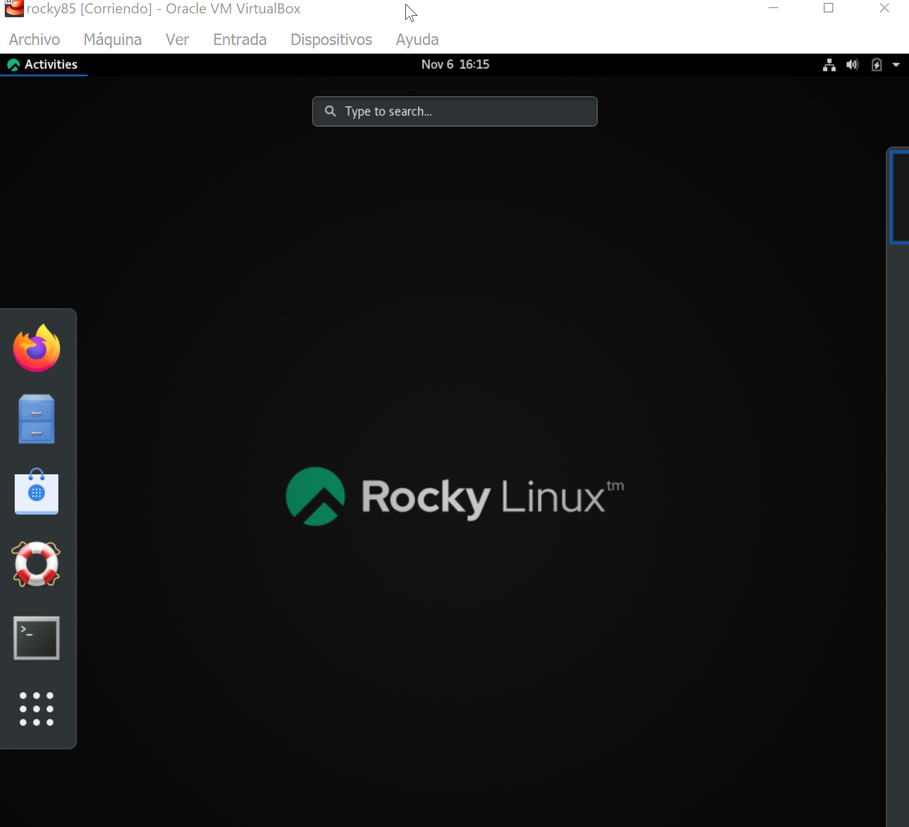
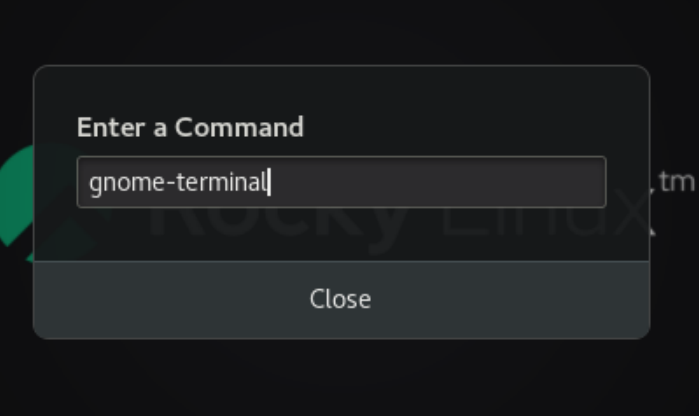
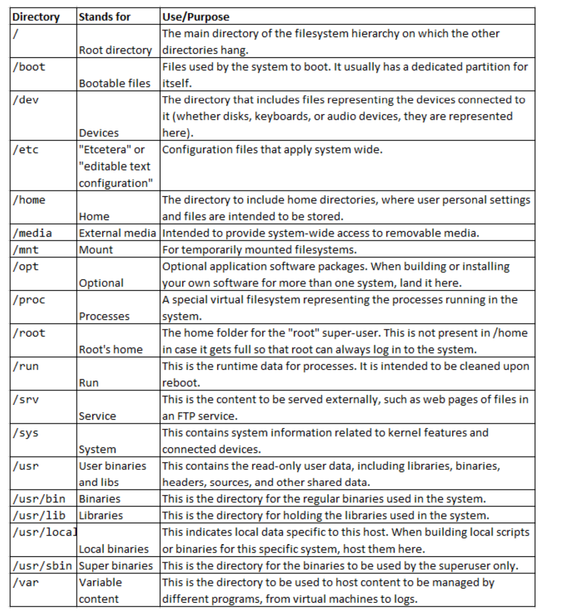

# CLASE 1

## Introducción

El usuario y la contraseña en la página de documentación:

https://cleformacion.com

usuario: alumno38i4
constraseña: 15Elc87

otro server

https://baseinfo.es

El último día de curso va a subir la documentación en el server:

'SE VA A HACER UN ZIP PARA DESCARGAR CON TODOS EJEMPLOS Y ETC'

Se va a guardar de 6 a 12 meses la info para el acceso

La docu es de la versión 9 y la máquina virtual es de la versión 8

### Presentación del curso

http://baseinfo.es/cursos/23023_linux/384.mkv

### CONTENIDOS

- Introducción a Red Hat Enterprise Linux

  - Conceptos generales
  - El Kernel de Linux

- Acceso a sistemas Linux mediante línea de comandos

  - Acceso a la línea de comandos por consola
  - Acceso a remoto a la línea de comandos

- Manejo de ficheros

  - Copia, traslado, creación, eliminación y organización desde el intérprete de comandos.
  - Edición de ficheros de texto.

- Acceso a la ayuda en línea de sistemas Linux

- Control de usuarios y grupos

- Permisos y control de acceso a ficheros en Linux

- Control y monitorización de procesos, servicios y demonios ("daemons")

- Ficheros de logs e introducción a la solución de problemas en Linux.

  registros de actividad del sistema (rotación de los ficheros logs)

- Administración de red en Linux

  - Configuración de interfaces de red
  - Configuración de rutas
  - Configuración de DNS
  - Configuración de servicios de red

- Manejo de software a través del gestor YUM o (DNF -- en la actualidad)

  - Ver formas de descargar e instalar paquetes de software (rpm, yum, dnf)
  - Actualización de paquetes de software

- Introducción a los sistemas de ficheros. (Casi lo primero que veremos)

  - Cómo podemos crear sistemas de ficheros
  - Cómo podemos montar sistemas de ficheros en el os
  - Cómo podemos particionar un disco duro del os con particionamiento básico
  - Gestor de volúmenes lógicos (LVM) --- (MUY IMPORTANTE) particionamiento dinámico

#### Entornos del curso

```txt
CLE Formación
Curso: Administración de Linux Red Hat

Instructor: Juan de Juan
            juandejuan@juandejuan.com


Entorno de documentacion:
	https://cleformacion.com
	Usuario: alumno384
	Contraseña: 15Elc87

	http://baseinfo.es/cursos/23023_linux/
	Usuario: alumno
	Contraseña: sf234Sww34
```

##### Libros del curso

http://baseinfo.es/cursos/23023_linux/doc/

##### Máquinas virtuales

http://baseinfo.es/cursos/23023_linux/mv/

##### Practicas

http://baseinfo.es/cursos/23023_linux/practicas/

##### Ejemplos

http://baseinfo.es/cursos/23023_linux/ejemplos/

##### Estructura vm

\_1 para hacer el swap

\_2 es para el

\_3 es vacía para luego jugar con ella

Para acceder a la máquina virtual:

user : usuario

pwd: usuario

### La UI d Rocky Linux

Para usarlo iremos a

ACTIVITIES



Para abrir el terminal

click en activities y click en terminal

Otra forma:

windows + R (terminal en windows)

alt + f2 (terminal en linux) (alt + fn + f2) si no está bien configurado el ordenador



En el command escribiremos: gnome-terminal

Pero más adelante podremos asociar el comando a una letra para ejecutarlo más rápido

#### Historia de Linux

UNIX y Linux són muy parecidos (aunqué entre los linux hay diferencias)

#### Distribuciones de Linux

Se empezarón a crear distribuciones de linux:

- Debian (más antigua y muy estable, distribuciones lentas)
- Ubuntu (derivada de Debian, linux muy conocido, distribuciones rápidas (servidor + escritorio))
- Red Hat (servicio de pago, usa linux) proyectos opensource de Red Hat --- (CentOS, Fedora, Rocky Linux)

Para usar Red Hat se necesita una licencia de pago. Por eso se crearon proyectos opensource de Red Hat

No usaremos red hat, usaremos Rocky Linux porqué es un proyecto de opensource que se parece mucho a Red Hat y es gratuito. En lo único que difiere y es importante es que no tiene soporte técnico.

CentOs desde la versión 8 ha sido descontinuado y se ha creado Rocky Linux

#### Rocky Linux

https://rockylinux.org/

Es un proyecto opensource que se ha creado para sustituir a CentOS en la sustitución de Red Hat para su uso gratuito y para aprender a usar Red Hat. Bit a bit, bug a bug compatible con Red Hat Enterprise Linux.

El libro que tenemos va de red hat pero lo usaremos para Rocky Linux porque funciona igual.

#### Qué es el kernel de Linux

--- Más adelante se verá

#### Crear una carpeta compartida

Hay que ir a la carpeta de la máquina virtual y crear una carpeta compartida

Luego en la máquina virtual hay que ir a la carpeta /mnt y crear una carpeta con el nombre que queramos (en este caso carpeta_compartida) esto es para hacer un montaje temporal.

```bash
[usuario@formacion ~]$ su -
Password: root
[root@formacion ~]# mount -t vboxsf apuntes /mnt
[root@formacion ~]# ^C
[root@formacion ~]# ^C
[root@formacion ~]# cd/mnt
-bash: cd/mnt: No such file or directory
[root@formacion ~]# mount -t vboxsf apuntes /mnt
[root@formacion ~]# cd/mnt
-bash: cd/mnt: No such file or directory
[root@formacion ~]# cd mnt
-bash: cd: mnt: No such file or directory
[root@formacion ~]# cd /mnt
[root@formacion mnt]# ls
fff.txt

```

Luego iniciamos un nautilus (explorador de archivos) y vamos a la carpeta /mnt y veremos la carpeta compartida.

Si montamos en una carpeta con datos existentes, estos datos quedarían ocultos (no se verían) hasta que desmontemos la carpeta compartida, y mientras esté la carpeta montada se verían sólo los datos de la carpeta compartida.

```bash
# Iniciar un Nautlius: alt + f2 nautilus
# control + l : /mnt

```

Iniciar la consola de administración

```bash
su -

init3


contraseña: root


init5 (para iniciar el entorno gráfico)
```

ctrl+alt+f1
crtl+alt+f2
crtl+alt+f3

En cada una de ellas habría un entorno gráfico diferente.
La forma ótpima de un linux es en una consola sin el cliente.

### Terminal vs consola

El terminal es distinto a la consola ya que la consola se encuentra directamente conectada al proceso. En cambio una terminal se encuentra vinculada al ámbiente gráfico, si al cliente grafica

Para ver los procesos:

```bash
[usuario@formacion mnt]$ pstree
systemd─┬─ModemManager───2*[{ModemManager}]
        ├─NetworkManager───2*[{NetworkManager}]
        ├─2*[VBoxClient───VBoxClient───2*[{VBoxClient}]]
        ├─VBoxClient───VBoxClient───3*[{VBoxClient}]
        ├─VBoxClient───VBoxDRMClient
        ├─VBoxService───8*[{VBoxService}]
        ├─accounts-daemon───2*[{accounts-daemon}]
        ├─alsactl
        ├─atd
        ├─auditd─┬─sedispatch
        │        └─2*[{auditd}]
        ├─avahi-daemon───avahi-daemon
        ├─colord───2*[{colord}]
        ├─crond
        ├─cupsd
        ├─dbus-daemon───{dbus-daemon}
        ├─dnsmasq───dnsmasq
        ├─firewalld───{firewalld}
        ├─fwupd───4*[{fwupd}]
        ├─gdm─┬─gdm-session-wor─┬─gdm-wayland-ses─┬─gnome-session-b─┬─gnome-she+
        │     │                 │                 │                 ├─gnome-sof+
        │     │                 │                 │                 ├─gsd-a11y-+
        │     │                 │                 │                 ├─gsd-accou+
        │     │                 │                 │                 ├─gsd-clipb+
        │     │                 │                 │                 ├─gsd-color+++
        │     │                 │                 │                 ├─gsd-datet+
        │     │                 │                 │                 ├─gsd-disk-+
        │     │                 │                 │                 ├─gsd-house+
        │     │                 │                 │                 ├─gsd-keybo+
        │     │                 │                 │                 ├─gsd-media+
        │     │                 │                 │                 ├─gsd-mouse+++
        │     │                 │                 │                 ├─gsd-power+++
        │     │                 │                 │                 ├─gsd-print+
        │     │                 │                 │                 ├─gsd-rfkil+
        │     │                 │                 │                 ├─gsd-scree+
        │     │                 │                 │                 ├─gsd-shari+
        │     │                 │                 │                 ├─gsd-smart+
        │     │                 │                 │                 ├─gsd-sound+++
        │     │                 │                 │                 ├─gsd-wacom+++
        │     │                 │                 │                 ├─gsd-xsett+
        │     │                 │                 │                 ├─tracker-m+
        │     │                 │                 │                 ├─tracker-m+
        │     │                 │                 │                 └─3*[{gnome+
        │     │                 │                 └─2*[{gdm-wayland-ses}]
        │     │                 └─2*[{gdm-session-wor}]
        │     └─2*[{gdm}]
        ├─gnome-keyring-d───3*[{gnome-keyring-d}]
        ├─5*[gpg-agent]
        ├─gsd-printer───2*[{gsd-printer}]
        ├─gssproxy───5*[{gssproxy}]
        ├─ibus-x11───12*[{ibus-x11}]
        ├─irqbalance───{irqbalance}
        ├─ksmtuned───sleep
        ├─lsmd
        ├─mcelog
        ├─packagekitd───2*[{packagekitd}]
        ├─polkitd───6*[{polkitd}]
        ├─rpcbind
        ├─rsyslogd───2*[{rsyslogd}]
        ├─rtkit-daemon───2*[{rtkit-daemon}]
        ├─smartd
        ├─sshd
        ├─sssd─┬─sssd_be
        │      └─sssd_nss
        ├─sssd_kcm
        ├─systemd─┬─(sd-pam)
        │         ├─at-spi-bus-laun─┬─dbus-daemon───{dbus-daemon}
        │         │                 └─3*[{at-spi-bus-laun}]
        │         ├─at-spi2-registr───2*[{at-spi2-registr}]
        │         ├─dbus-daemon───{dbus-daemon}
        │         ├─dconf-service───2*[{dconf-service}]
        │         ├─evolution-addre─┬─evolution-addre───5*[{evolution-addre}]
        │         │                 └─4*[{evolution-addre}]
        │         ├─evolution-calen─┬─evolution-calen───8*[{evolution-calen}]
        │         │                 └─4*[{evolution-calen}]
        │         ├─evolution-sourc───3*[{evolution-sourc}]
        │         ├─gnome-shell-cal───5*[{gnome-shell-cal}]
        │         ├─gnome-terminal-─┬─bash───pstree
        │         │                 └─3*[{gnome-terminal-}]
        │         ├─goa-daemon───3*[{goa-daemon}]
        │         ├─goa-identity-se───3*[{goa-identity-se}]
        │         ├─gvfs-afc-volume───3*[{gvfs-afc-volume}]
        │         ├─gvfs-goa-volume───2*[{gvfs-goa-volume}]
        │         ├─gvfs-gphoto2-vo───2*[{gvfs-gphoto2-vo}]
        │         ├─gvfs-mtp-volume───2*[{gvfs-mtp-volume}]
        │         ├─gvfs-udisks2-vo───3*[{gvfs-udisks2-vo}]
        │         ├─gvfsd─┬─gvfsd-trash───2*[{gvfsd-trash}]
        │         │       └─2*[{gvfsd}]
        │         ├─gvfsd-fuse───5*[{gvfsd-fuse}]
        │         ├─gvfsd-metadata───2*[{gvfsd-metadata}]
        │         ├─ibus-portal───2*[{ibus-portal}]
        │         ├─pulseaudio───2*[{pulseaudio}]
        │         ├─tracker-store───4*[{tracker-store}]
        │         └─xdg-permission-───2*[{xdg-permission-}]
        ├─systemd-journal
        ├─systemd-logind
        ├─systemd-machine
        ├─systemd-udevd
        ├─tuned───4*[{tuned}]
        ├─udisksd───4*[{udisksd}]
        ├─upowerd───2*[{upowerd}]
        └─wpa_supplicant

```

#### LOGIN DEL USUARIO

Se usa el comando `su -` para hacer el login de usuario o incluso para hacer el cambio entre usuarios

```bash
su -
Password: root


su - usuario
Password: usuario

```

- En windows habría dos formas básciaa

  - cmd
  - powershell

- En linux hay muchas formas de hacerlo
  - bash (bourne again shell) instalado (es un sh mejorado y es el que usan la mayoría de distribuciones)
  - sh (bourne shell) instalado
  - csh (c shell) usado en entronos de programación de C
  - ksh (korn shell) usado en entornos de programación de C
    .
    .
    .

Hay un fichero en todo linux que es:

```bash
/etc/passwd
```

Este fichero contiene los usarios del sistema operativo

Para acceder usamos el comando `cat` de bash

```bash
cat /etc/passwd
```

```bash
root:x:0:0:root:/root:/bin/bash
```

Hay usuarios especiales cómo:

```bash

shutdown:x:6:0:shutdown:/sbin:/sbin/shutdown

halt:x:7:0:halt:/sbin:/sbin/halt
```

Pero el resto nologin usuarios són cuentas especiales del sistema operativo y se usan en momentos concretos.

Los usarios configurados empiexzan con el código 1000

```bash
usuario:x:1000:1000:usuario:/home/usuario:/bin/bash
```

Si modificamos el usuario creado y le añadimos un nologin

```bash
usuario:x:1000:1000:usuario:/home/usuario:/bin/bash/sbin/nologin
```

La sesión se inicia con el interprete de comandos que esté indicado en el archivo /etc/passwd

```bash
usuario:x:1000:1000:usuario:/home/usuario:/bin/bash empezaria con el bash
```

la cuenta root tiene un id 0

se sabe con el comando id

```bash
[root@formacion ~]# id
uid=0(root) gid=0(root) groups=0(root) context=unconfined_u:unconfined_r:unconfined_t:s0-s0:c0.c1023

```

El usuario root a diferencia de los usuarios normales tiene acceso a todo el sistema operativo y en sus comandos aparece la almohadilla (#) en vez del dolar ($)

````bash

```BASH
[usuario@formacion mnt]$ su -
Password:
su: Authentication failure
[usuario@formacion mnt]$ su - usuario
Password:
[usuario@formacion ~]$ id
uid=1000(usuario) gid=1000(usuario) groups=1000(usuario) context=unconfined_u:unconfined_r:unconfined_t:s0-s0:c0.c1023
[usuario@formacion ~]$ hostname
formacion
[usuario@formacion ~]$
````

Los usuarios para servicios serian los 'DAEMONS'

Para nuestra información nuestros usuarios se crean a partir de un valor 1000 hacia arriba para que no se confundan con los usuarios del sistema operativo para procesos o servicios los cuales se encuentran por debajo del valor 1000 (por el momento)

```bash
[usuario@formacion mnt]$ su -
Password:
su: Authentication failure
[usuario@formacion mnt]$ su - usuario
Password:
[usuario@formacion ~]$ id
uid=1000(usuario) gid=1000(usuario) groups=1000(usuario) context=unconfined_u:unconfined_r:unconfined_t:s0-s0:c0.c1023
[usuario@formacion ~]$ hostname
formacion
[usuario@formacion ~]$
```

Ni el propio redhat se aclara al empezar a asignar usuarios (de forma predeterminada se generan en el valor 1000) pero actualmente para que no se mezclen los usuarios personales con los usuarios de servicio se recomienda que se generen los usuarios personales que se creen los usuarios de trabajo a partir del valor 5000 o incluso 10000.

El root siempre va a ser el 0

con el comando `exit` salimos de la sesión de usuario

```bash
[usuario@formacion ~]$ exit
logout
[usuario@formacion mnt]$ exit
logout
[usuario@formacion ~]$
```

Más adelante veremos el comando sudo o sudoers para limitar las acciones de los usuarios y que no puedan hacer todo lo que quieran. Por mediante de sudo se puede dar permisos a los usuarios para que puedan hacer cosas de root sin tener que trabajar con el usuario root. Así nos podemos asegurar que no se hagan cosas que no queremos que se hagan.

### COMANDO ECHO

El comando echo sirve para mostrar información por pantalla. Es la salida estándar de la consola. Se puede mostrar información por pantalla con el comando echo o sin el. (mandar a la salida estándar el texto que he puesto)

```bash
[usuario@formacion ~]$ echo "hola mundo"
hola mundo
[usuario@formacion ~]$ echo hola mundo
hola mundo
[usuario@formacion ~]$ echo hola
hola
[usuario@formacion ~]$ echo hola mundo
hola mundo
```

Aunque echo también resuleve variables de entorno

```bash
[usuario@formacion ~]$ echo $PATH
/usr/local/bin:/usr/bin:/usr/local/sbin:/usr/sbin:/home/usuario/.local/bin:/home/usuario/bin
[usuario@formacion ~]$ echo $HOME
/home/usuario
[usuario@formacion ~]$ echo $USER
usuario
[usuario@formacion ~]$ echo $SHELL
/bin/bash
[usuario@formacion ~]$ echo $PATH
/usr/local/bin:/usr/bin:/usr/local/sbin:/usr/sbin:/h
```

#### $VARIABLESENTORNO

Para ver las variables de entorno se usa el comando `env`

```bash
[usuario@formacion ~]$ env
XDG_SESSION_ID=1
HOSTNAME=formacion
TERM=xterm-256color
SHELL=/bin/bash
HISTSIZE=1000
SSH_CLIENT=
SSH_TTY=/dev/pts/0
USER=usuario
...
```

Para mostrar el valor de las variables de entorno se usa el comando `echo $VARIABLESENTORNO`

Las variables básicas de entorno:

- $USER - usuario actual
- $HOME - directorio home del usuario actual (home directory)
- $PATH - rutas de búsqueda de comandos
- $SHELL - interprete de comandos
- $PWD - directorio actual (present working directory) (pwd)
- $HOSTNAME - nombre del equipo (hostname)
- $LANG - idioma del sistema (language)
- $EDITOR - editor de texto (editor)
- $PS1 - prompt de la consola (prompt string 1) La combinación de caracteres que aparecen en la consola antes de escribir un comando Por ejemplo: [usuario@formacion ~]$ echo $PS1 seria [\u@\h \W]\$ (Dónde \u es el usuario, \h es el hostname y \W es el directorio actual con el $ al final para indicar que es el prompt de la consola)

````bash

En el caso de $PWD existe también el comando

```bash
[usuario@formacion ~]$ echo $USER
usuario
[usuario@formacion ~]$ echo $HOME
/home/usuario
[usuario@formacion ~]$ echo $PATH
/usr/local/bin:/usr/bin:/usr/local/sbin:/usr/sbin:/home/usuario/.local/bin:/home/usuario/bin
[usuario@formacion ~]$ echo $SHELL
/bin/bash
[usuario@formacion ~]$ echo $PWD -
/home/usuario
[usuario@formacion ~]$ pwd
/home/usuario
[usuario@formacion ~]$ echo $HOSTNAME
formacion
[usuario@formacion ~]$ echo $LANG
es_ES.UTF-8
[usuario@formacion ~]$ echo $EDITOR
vi
[usuario@formacion ~]$ echo $PS1
[\u@\h \W]\$
````

Nos aparecent todas las variables que se usan en el entorno actual

### Ejecutar un programa desde linea de comandos

Prieo de todo hay que saber que es un programa y que es un comando.

Por ejemplo si quiero ejecutar firefox:

```bash
[usuario@formacion ~]$ firefox
bash: firefox: command not found...
```

Necesita primero saber dónde tengo el firefox

```bash
    [usuario@formacion ~]$ which firefox
    /usr/bin/which: no firefox in (/usr/local/bin:/usr/bin:/usr/local/sbin:/usr/sbin:/home/usuario/.local/bin:/home/usuario/bin)
```

Bash nos muestra información en pantalla usando el programa sed (stream editor)

Se puede cambiar el path del home con un export var arreglar los $Path de las variables de entorno. (Es el path de búsqueda de comandos)

Se estructura de la siguiente forma:

```bash
$ export PATH=rutaOriginal:rutaNueva
```

```bash
[usuario@formacion ~]$ export PATH=$PATH:/usr/bin
[usuario@formacion ~]$ which firefox
/usr/bin/firefox
[usuario@formacion ~]$ firefox
```

### MOVERSE CON LA ESTRUCTURA DE CARPETAS

COMANDO PRINCIPAL:

Moverse:

```bash
cd
```

Y listar directorio:

```bash
ls
```

o para más detalle

```bash
ls -l == ll
```

ll

ls -a

ls -la

ls -lah

En un linux la / es la raíz del sistema operativo

```bash
[usuario@formacion mnt]$ cd /
[usuario@formacion /]$ pwd
/
[usuario@formacion /]$ ls
bin   dev  home  lib64  mnt  proc  run   srv  tmp  var
boot  etc  lib   media  opt  root  sbin  sys  usr
[usuario@formacion /]$ ls -l
total 24
lrwxrwxrwx.   1 root root    7 Oct 11  2021 bin -> usr/bin
dr-xr-xr-x.   5 root root 4096 Mar 13  2022 boot
drwxr-xr-x.  19 root root 3200 Nov  6 15:57 dev
drwxr-xr-x. 145 root root 8192 Nov  6 15:57 etc
drwxr-xr-x.   3 root root   21 Mar 13  2022 home
lrwxrwxrwx.   1 root root    7 Oct 11  2021 lib -> usr/lib
lrwxrwxrwx.   1 root root    9 Oct 11  2021 lib64 -> usr/lib64
drwxr-xr-x.   2 root root    6 Oct 11  2021 media
drwxrwxrwx.   1 root root    0 Nov  6 17:27 mnt
drwxr-xr-x.   3 root root   39 Mar 13  2022 opt
dr-xr-xr-x. 240 root root    0 Nov  6 15:57 proc
dr-xr-x---.   6 root root  255 Nov  6 17:34 root
drwxr-xr-x.  42 root root 1260 Nov  6 16:17 run
lrwxrwxrwx.   1 root root    8 Oct 11  2021 sbin -> usr/sbin
drwxr-xr-x.   2 root root    6 Oct 11  2021 srv
dr-xr-xr-x.  13 root root    0 Nov  6 15:57 sys
drwxrwxrwt.  10 root root 4096 Nov  6 18:07 tmp
drwxr-xr-x.  13 root root  158 Mar 13  2022 usr
drwxr-xr-x.  21 root root 4096 Mar 13  2022 var
[usuario@formacion /]$
```

la _l_ indica que es un vínculo (acceso directo de windows)
la _d_ indica que es un directorio
los *-*son ficheros

La carpeta home de linux es donde se guardan los usuarios

```bash
[usuario@formacion /]$ cd home
[usuario@formacion home]$ ls
usuario
[usuario@formacion home]$ cd usuario
[usuario@formacion usuario]$ ls
apuntes  bin  carpeta_compartida  Desktop  Documents  Downloads  Music  Pictures  Public  Templates  Videos
[usuario@formacion usuario]$ cd apuntes
[usuario@formacion apuntes]$ ls
[usuario@formacion apuntes]$ cd ..
```

Ejemplo real:

```bash
[usuario@formacion /]$ cd /home
[usuario@formacion home]$ pwd
/home
[usuario@formacion home]$ ls
usuario
[usuario@formacion home]$ ls -l
total 4
drwx------. 15 usuario usuario 4096 Nov  6 17:46 usuario
[usuario@formacion home]$ cd usuario
[usuario@formacion ~]$ ls
Desktop  Documents  Downloads  Music  Pictures  Public  Templates  Videos
[usuario@formacion ~]$ ls -l
total 0
drwxr-xr-x. 2 usuario usuario 6 Mar 13  2022 Desktop
drwxr-xr-x. 2 usuario usuario 6 Mar 13  2022 Documents
drwxr-xr-x. 2 usuario usuario 6 Mar 13  2022 Downloads
drwxr-xr-x. 2 usuario usuario 6 Mar 13  2022 Music
drwxr-xr-x. 2 usuario usuario 6 Mar 13  2022 Pictures
drwxr-xr-x. 2 usuario usuario 6 Mar 13  2022 Public
drwxr-xr-x. 2 usuario usuario 6 Mar 13  2022 Templates
drwxr-xr-x. 2 usuario usuario 6 Mar 13  2022 Videos
```

Para salir de carpetas se usa:

```bash
cd ..
```

otro comando para listar archivos clave: es el ls -a

_El ls -a muestra los archivos ocultos_

```bash
[usuario@formacion ~]$ ls -a
.   .bash_history  .bashrc  .cache  .config  .local  .mozilla  .ssh  .viminfo
..  .bash_logout   .cache1  .conda  .gnupg   .pki     .profile  .vim
[usuario@formacion ~]$
```

_Tambien podemos usar el comando ls -la par ver todos los detalles_

```bash
[usuario@formacion /]$ ls -la
total 24
dr-xr-xr-x.  17 root root  224 Mar 13  2022 .
dr-xr-xr-x.  17 root root  224 Mar 13  2022 ..
lrwxrwxrwx.   1 root root    7 Oct 11  2021 bin -> usr/bin
dr-xr-xr-x.   5 root root 4096 Mar 13  2022 boot
drwxr-xr-x.  19 root root 3200 Nov  6 15:57 dev
drwxr-xr-x. 145 root root 8192 Nov  6 15:57 etc
drwxr-xr-x.   3 root root   21 Mar 13  2022 home
lrwxrwxrwx.   1 root root    7 Oct 11  2021 lib -> usr/lib
lrwxrwxrwx.   1 root root    9 Oct 11  2021 lib64 -> usr/lib64
drwxr-xr-x.   2 root root    6 Oct 11  2021 media
drwxrwxrwx.   1 root root    0 Nov  6 17:27 mnt
drwxr-xr-x.   3 root root   39 Mar 13  2022 opt
dr-xr-xr-x. 239 root root    0 Nov  6 15:57 proc
dr-xr-x---.   6 root root  255 Nov  6 17:34 root
drwxr-xr-x.  42 root root 1260 Nov  6 16:17 run
lrwxrwxrwx.   1 root root    8 Oct 11  2021 sbin -> usr/sbin
drwxr-xr-x.   2 root root    6 Oct 11  2021 srv
dr-xr-xr-x.  13 root root    0 Nov  6 15:57 sys
drwxrwxrwt.  10 root root 4096 Nov  6 18:07 tmp
drwxr-xr-x.  13 root root  158 Mar 13  2022 usr
drwxr-xr-x.  21 root root 4096 Mar 13  2022 var
```

Éjemplo de diferencia entre a y l al listar directorios

```bash
[usuario@formacion /]$ cd /home
[usuario@formacion home]$ cd usuario
[usuario@formacion ~]$ cd ./
[usuario@formacion ~]$ ls -a
.              Documents      Public
..             Downloads      Templates
.bash_history  .esd_auth      .vboxclient-clipboard.pid
.bash_logout   .ICEauthority  .vboxclient-display-svga-x11.pid
.bash_profile  .local         .vboxclient-draganddrop.pid
.bashrc        .mozilla       .vboxclient-seamless.pid
.cache         Music          Videos
.config        Pictures       .xauth0RImUu
Desktop        .pki           .xauthjOrxYa
[usuario@formacion ~]$ ls -la
total 52
drwx------. 15 usuario usuario 4096 Nov  6 17:46 .
drwxr-xr-x.  3 root    root      21 Mar 13  2022 ..
-rw-------.  1 usuario usuario   57 Nov  6 17:24 .bash_history
-rw-r--r--.  1 usuario usuario   18 Jul 27  2021 .bash_logout
-rw-r--r--.  1 usuario usuario  141 Jul 27  2021 .bash_profile
-rw-r--r--.  1 usuario usuario  376 Jul 27  2021 .bashrc
drwxr-xr-x. 12 usuario usuario  271 Nov  6 16:18 .cache
drwx------. 12 usuario usuario  231 Nov  6 16:50 .config
drwxr-xr-x.  2 usuario usuario    6 Mar 13  2022 Desktop
drwxr-xr-x.  2 usuario usuario    6 Mar 13  2022 Documents
drwxr-xr-x.  2 usuario usuario    6 Mar 13  2022 Downloads
-rw-------.  1 usuario usuario   16 Mar 13  2022 .esd_auth
-rw-------.  1 usuario usuario 1864 Nov  6 16:09 .ICEauthority
drwx------.  3 usuario usuario   19 Mar 13  2022 .local
drwxr-xr-x.  6 usuario usuario   81 Nov  6 16:18 .mozilla
drwxr-xr-x.  2 usuario usuario    6 Mar 13  2022 Music
drwxr-xr-x.  2 usuario usuario    6 Mar 13  2022 Pictures
drwxrw----.  3 usuario usuario   19 Mar 13  2022 .pki
drwxr-xr-x.  2 usuario usuario    6 Mar 13  2022 Public
drwxr-xr-x.  2 usuario usuario    6 Mar 13  2022 Templates
-rw-r-----.  1 usuario usuario    5 Nov  6 16:10 .vboxclient-clipboard.pid
-rw-r-----.  1 usuario usuario    6 Nov  6 16:10 .vboxclient-display-svga-x11.pid
-rw-r-----.  1 usuario usuario    5 Nov  6 16:10 .vboxclient-draganddrop.pid
-rw-r-----.  1 usuario usuario    5 Nov  6 16:10 .vboxclient-seamless.pid
drwxr-xr-x.  2 usuario usuario    6 Mar 13  2022 Videos
-rw-------.  1 usuario usuario  106 Nov  6 17:46 .xauth0RImUu
-rw-------.  1 usuario usuario  106 Nov  6 17:31 .xauthjOrxYa
[usuario@formacion ~]$ ls
Desktop  Documents  Downloads  Music  Pictures  Public  Templates  Videos
[usuario@formacion ~]$ ls -l
total 0
drwxr-xr-x. 2 usuario usuario 6 Mar 13  2022 Desktop
drwxr-xr-x. 2 usuario usuario 6 Mar 13  2022 Documents
drwxr-xr-x. 2 usuario usuario 6 Mar 13  2022 Downloads
drwxr-xr-x. 2 usuario usuario 6 Mar 13  2022 Music
drwxr-xr-x. 2 usuario usuario 6 Mar 13  2022 Pictures
drwxr-xr-x. 2 usuario usuario 6 Mar 13  2022 Public
drwxr-xr-x. 2 usuario usuario 6 Mar 13  2022 Templates
drwxr-xr-x. 2 usuario usuario 6 Mar 13  2022 Videos
[usuario@formacion ~]$
```

_Los ficheros ocultos empiezan con un ._ (punto)\_\*

Se puede usar la virgulilla = '~' para ir al home del usuario este caracter es un alias para el home del usuario se puede entrar mediante la combinación de teclas alt gr + 4

#### RUTAS RELATIVAS Y RUTAS ABSOLUTAS

Las rutas relativas son las que se usan para moverse por el sistema operativo y se usan para moverse por el sistema operativo. Se usan para moverse por el sistema operativo. Empiezan desde el pwd (present working directory).

En cambio

Las rutas absolutas empiezan desde la raíz del sistema operativo (/)

```bash

Hemos repasado el tema 3 del libro desde la página 60 del libro / 83 pdf
```

Con touch se crean ficheros

```bash
touch fff.txt
```

o

```bash
touch fff.txt fff2.txt
```

#### SABER SI PODEMOS ESCRIBIR O NO EN UNA CARPETA

drwxr-xr-x. --- NO PODEMOS ESCRIBIR

drwxr-xr-x. --- Directorio dónde podemos escribir

### AUTOCOMPLETAR CON EL TABULADOR EN LINUX CON BASH

Con el tabulador sólo en bash podemos autocompletar los comandos y las rutas. Similar a lo que usamos en las suggerencias de copilot. Si hay ambiguedades muestra todas las posibilidades.

```bash
[usuario@formacion /]$ cd /
bin/   dev/   home/  lib64/ mnt/   proc/  run/   srv/   tmp/   var/
boot/  etc/   lib/   media/ opt/   root/  sbin/  sys/   usr/
[usuario@formacion /]$ cd /
bin/   dev/   home/  lib64/ mnt/   proc/  run/   srv/   tmp/   var/
boot/  etc/   lib/   media/ opt/   root/  sbin/  sys/   usr/
[usuario@formacion /]$ cd /
bin/   dev/   home/  lib64/ mnt/   proc/  run/   srv/   tmp/   var/
boot/  etc/   lib/   media/ opt/   root/  sbin/  sys/   usr/
[usuario@formacion /]$ cd /etc/
Display all 151 possibilities? (y or n)
[usuario@formacion /]$ cd /etc/sys
sysconfig/ sysctl.d/  systemd/
[usuario@formacion /]$ cd /etc/sys
sysconfig/ sysctl.d/  systemd/
[usuario@formacion /]$ cd /etc/sys
sysconfig/ sysctl.d/  systemd/
[usuario@formacion /]$ cd /etc/NetworkManager/
```

#### COMANDO history

Es un comando que muestra todos los comandos de la sesión

Un comando muy útil pero muy peligroso. Si se usa el comando history se puede ver todos los comandos que se han ejecutado en la sesión. Si se quiere borrar el historial se puede usar el comando history

```bash
[usuario@formacion /]$ history
    1  cd /dev
    2  ls
    3  poweroff
    4  su -
    5  - su
    6  -su
    7  - su
    8  su -
    9  cd /mnt
   10  exit
   11  firefox
   12  pwd
   13  echo $PATH
   14  which firefox
   15  which nautilus
   16  which bash
   17  which pwd
   18  cd /
   19  pwd
   20  ls
   21  ls -l
   22  cd /home
   23  pwd
   24  ls
   25  ls -l
   26  cd usuario
   27  ls
   28  ls -l
   29  cd /desktop
   30  cd /Desktop
   31  cd desktop
   32  de Desktop
   33  cd Desktop
   34  cd ..
   35  cd /
   36  ls -a
   37  ls l
   38  ls
   39  ls -la
   40  cd /Documents
   41  cd /home
   42  cd usuario
   43  cd ./
   44  ls -a
   45  ls -la
   46  ls
   47  ls -l
   48  /home
   49  cd /home
   50  ls
   51  cd ls -l
   52  ls -l
   53  cd usuario
   54  ls -l
   55  cd /Desktop
   56  cd Documents
   57  cd /Documents
   58  ls
   59  ls -l
   60  ls -lah
   61  cd /home
   62  ls
   63  cd usuario
   64  ls
   65  de Desktop
   66  cd /Desktop
   67  cd /
   68  ls
   69  ls -l
   70  history
```

y puedes hacer un touch en cualquier sitio para crear estos ficheros.

Por eso no debemos usar las contraseñas directamente metidas en el terminal. Si se quiere usar una contraseña se puede usar el comando `read` para que no se vea la contraseña en el historial.
O usar -uroot -p -hhostname para que no se muestre la constraseña.

Aunqué usemos el comando `exit` para salir, si volvemos

El historial lo guarda en el fichero ~/.bash_history

Por eso es necesario saber cómo remover el historial de comandos.

```bash
[usuario@formacion /]$ history -c
[usuario@formacion /]$ rm ~/.bash_history
[usuario@formacion /]$ history
    1  history 	    #No muestra nada porque hemos borrado el historial
```

history -c borra el historial de comandos

Por ejemplo también podemos volver a ejecutar el mismo comando anterior usando

```bash
[usuario@formacion /]$ !-1
[usuario@formacion /]$ !-2
```

o

```bash
[usuario@formacion /]$ !!
```

#### Estructura de ficheros



Los sata devices

```bash
[root@formacion /]# cd /dev
[root@formacion dev]# ls -l

brw-rw----. 1 root    disk      8,   0 Nov  6 15:57 sda
brw-rw----. 1 root    disk      8,   1 Nov  6 15:57 sda1
brw-rw----. 1 root    disk      8,  16 Nov  6 15:57 sdb
brw-rw----. 1 root    disk      8,  17 Nov  6 15:57 sdb1
brw-rw----. 1 root    disk      8,  32 Nov  6 15:57 sdc
brw-rw----. 1 root    disk      8,  48 Nov  6 15:57 sdd
```

Con el comando `file` podemos ver el tipo de fichero que es

```bash
[root@formacion dev]# file sda
sda: block special (8/0)
[root@formacion dev]# file sda1
sda1: block special (8/1)
[root@formacion dev]# file sdb
sdb: block special (8/16)
[root@formacion dev]# file sdb1
sdb1: block special (8/17)
[root@formacion dev]# file sdc
sdc: block special (8/32)
[root@formacion dev]# file sdd
sdd: block special (8/48)
```

Estos serian los discos duros del sistema operativo

O por ejemplo también podríamos ver con `file` es

EN cd/etc podemos ver todos los archivos de config del sistema.

```bash
[root@formacion dev]# cd /etc
[root@formacion etc]# ls
accountsservice             dracut.conf      ksmtuned.conf             os-release              sestatus.conf
adjtime                     dracut.conf.d    ld.so.cache               ostree                  setroubleshoot
aliases                     egl              ld.so.conf                PackageKit              sgml
alsa                        enscript.cfg     ld.so.conf.d              pam.d                   shadow
alternatives                environment      libaudit.conf             papersize               shadow-
anaconda                    ethertypes       libblockdev               passwd                  shells
anacrontab                  exports          libibverbs.d              passwd-                 skel
asound.conf                 exports.d        libnl                     pbm2ppa.conf            smartmontools
at.deny                     favicon.png      libpaper.d                pinforc                 sos
audit                       filesystems      libreport                 pipewire                speech-dispatcher
authselect                  firefox          libssh                    pkcs11                  ssh
avahi                       firewalld        libuser.conf              pki                     ssl
bash_completion.d           flatpak          libvirt                   plymouth                sssd
bashrc                      fonts            locale.conf               pm                      subgid
bindresvport.blacklist      fprintd.conf     localtime                 pnm2ppa.conf            subgid-
binfmt.d                    fstab            login.defs                polkit-1                subuid
bluetooth                   fuse.conf        logrotate.conf            popt.d                  subuid-
brlapi.key                  fwupd            logrotate.d               prelink.conf.d          sudo.conf
brltty                      gconf            lsm                       printcap                sudoers
brltty.conf                 gcrypt           lvm                       profile                 sudoers.d
centos-release              gdm              machine-id                profile.d               sudo-ldap.conf
chkconfig.d                 geoclue          magic                     protocols               sysconfig
chromium                    glvnd            mailcap                   pulse                   sysctl.conf
chrony.conf                 gnupg            makedumpfile.conf.sample  qemu-ga                 sysctl.d
chrony.keys                 GREP_COLORS      man_db.conf               qemu-kvm                systemd
cifs-utils                  groff            mcelog                    radvd.conf              system-release
cni                         group            mecabrc                   ras                     system-release-cpe
cockpit                     group-           microcode_ctl             rc0.d                   tcsd.conf
containers                  grub2.cfg        mime.types                rc1.d                   terminfo
cron.d                      grub.d           mke2fs.conf               rc2.d                   tmpfiles.d
cron.daily                  gshadow          modprobe.d                rc3.d                   trusted-key.key
cron.deny                   gshadow-         modules-load.d            rc4.d                   tuned
cron.hourly                 gss              motd                      rc5.d                   udev
cron.monthly                gssproxy         motd.d                    rc6.d                   udisks2
crontab                     host.conf        mtab                      rc.d                    unbound
cron.weekly                 hostname         mtools.conf               rc.local                updatedb.conf
crypto-policies             hosts            multipath                 rdma                    UPower
crypttab                    hp               my.cnf                    redhat-release          usb_modeswitch.conf
csh.cshrc                   idmapd.conf      my.cnf.d                  request-key.conf        vconsole.conf
csh.login                   init.d           nanorc                    request-key.d           vimrc
cups                        initial-setup    ndctl                     resolv.conf             virc
cupshelpers                 inittab          netconfig                 rhsm                    vmware-tools
dbus-1                      inputrc          NetworkManager            rocky-release           wgetrc
dconf                       insights-client  networks                  rocky-release-upstream  wpa_supplicant
default                     iproute2         nfs.conf                  rpc                     X11
depmod.d                    iscsi            nfsmount.conf             rpm                     xattr.conf
dhcp                        issue            nftables                  rsyslog.conf            xdg
DIR_COLORS                  issue.d          nsswitch.conf             rsyslog.d               xinetd.d
DIR_COLORS.256color         issue.net        nsswitch.conf.bak         rwtab.d                 xml
DIR_COLORS.lightbgcolor     kdump            nvme                      samba                   yum
dkms                        kdump.conf       oddjob                    sane.d                  yum.conf
dleyna-server-service.conf  kernel           oddjobd.conf              sasl2                   yum.repos.d
dnf                         keyutils         oddjobd.conf.d            security
dnsmasq.conf                krb5.conf        openldap                  selinux
dnsmasq.d                   krb5.conf.d      opt                       services
```

Listando todos los DAEMOS y los configs

Ademas con el comando `shadow` lista los usuarios y las contraseñas encriptadas

```bash
[root@formacion etc]# cat fstab

#
# /etc/fstab
# Created by anaconda on Sun Mar 13 20:35:22 2022
#
# Accessible filesystems, by reference, are maintained under '/dev/disk/'.
# See man pages fstab(5), findfs(8), mount(8) and/or blkid(8) for more info.
#
# After editing this file, run 'systemctl daemon-reload' to update systemd
# units generated from this file.
#
UUID=6a464459-ea7f-4533-bfd7-a1aacd302170 /                       xfs     defaults        0 0
[root@formacion etc]# cat shadow
root:$6$.gAJywLqBwPbn55.$W9hkv5VvR31Dh8f5gWbTnh6y1P3UKW4Vu5B.nasl3hbx.e2RUwdveD4AJHBdF7dsD4qzX89g4WksHGmEsPdDY1::0:99999:7:::
bin:*:18700:0:99999:7:::
daemon:*:18700:0:99999:7:::
adm:*:18700:0:99999:7:::
lp:*:18700:0:99999:7:::
sync:*:18700:0:99999:7:::
shutdown:*:18700:0:99999:7:::
halt:*:18700:0:99999:7:::
mail:*:18700:0:99999:7:::
operator:*:18700:0:99999:7:::
games:*:18700:0:99999:7:::
ftp:*:18700:0:99999:7:::
nobody:*:18700:0:99999:7:::
dbus:!!:19064::::::
systemd-coredump:!!:19064::::::
systemd-resolve:!!:19064::::::
tss:!!:19064::::::
polkitd:!!:19064::::::
geoclue:!!:19064::::::
rtkit:!!:19064::::::
pipewire:!!:19064::::::
pulse:!!:19064::::::
qemu:!!:19064::::::
clevis:!!:19064::::::
usbmuxd:!!:19064::::::
unbound:!!:19064::::::
gluster:!!:19064::::::
rpc:!!:19064:0:99999:7:::
avahi:!!:19064::::::
chrony:!!:19064::::::
setroubleshoot:!!:19064::::::
saslauth:!!:19064::::::
libstoragemgmt:!!:19064::::::
dnsmasq:!!:19064::::::
radvd:!!:19064::::::
sssd:!!:19064::::::
cockpit-ws:!!:19064::::::
cockpit-wsinstance:!!:19064::::::
flatpak:!!:19064::::::
colord:!!:19064::::::
rpcuser:!!:19064::::::
gdm:!!:19064::::::
gnome-initial-setup:!!:19064::::::
tcpdump:!!:19064::::::
sshd:!!:19064::::::
usuario:$6$Fn71114Qqj7wjgH3$/cZqUybXpYOTO834CALVlyjQvWn2Yiug5poVfB2/KCci7bqct82EJu.hlcgaj6Nmw0KCQf8OdBSXcPmT00TZe1::0:99999:7:::
vboxadd:!!:19064::::::
mysql:!!:19064::::::

```

Con los comandos `du` y `df` podemos ver el espacio que ocupan los ficheros

```bash
[root@formacion etc]# du -sh
1.1G	.
[root@formacion etc]# df -h
Filesystem      Size  Used Avail Use% Mounted on
```

`du -sh` muestra el espacio que ocupa el directorio actual

```bash
[root@formacion etc]# du /etc
40	/etc/dnf/modules.d
0	/etc/dnf/aliases.d
0	/etc/dnf/modules.defaults.d
0	/etc/dnf/plugins/copr.d
12	/etc/dnf/plugins
20	/etc/dnf/protected.d
4	/etc/dnf/vars
80	/etc/dnf
16	/etc/fonts/conf.d
20	/etc/fonts
4	/etc/libreport/events
24	/etc/libreport/events.d
16	/etc/libreport/plugins
8	/etc/libreport/workflows.d
68	/etc/libreport
0	/etc/skel/.mozilla/extensions
0	/etc/skel/.mozilla/plugins
0	/etc/skel/.mozilla
12	/etc/skel
0	/etc/openldap/certs
4	/etc/openldap
72	/etc/logrotate.d
0	/etc/X11/fontpath.d
0	/etc/X11/applnk
16	/etc/X11/xinit/xinitrc.d
0	/etc/X11/xinit/Xclients.d
4	/etc/X11/xinit/xinput.d
36	/etc/X11/xinit
4	/etc/X11/xorg.conf.d
8	/etc/X11/Xsession.d
56	/etc/X11
120	/etc/profile.d
88	/etc/bash_completion.d
4	/etc/hp
16	/etc/pki/rpm-gpg
148	/etc/pki/ca-trust/extracted/edk2
148	/etc/pki/ca-trust/extracted/java
244	/etc/pki/ca-trust/extracted/openssl
352	/etc/pki/ca-trust/extracted/pem
896	/etc/pki/ca-trust/extracted
0	/etc/pki/ca-trust/source/anchors
0	/etc/pki/ca-trust/source/blacklist
4	/etc/pki/ca-trust/source
908	/etc/pki/ca-trust
0	/etc/pki/java
0	/etc/pki/tls/certs
0	/etc/pki/tls/misc
0	/etc/pki/tls/private
16	/etc/pki/tls
0	/etc/pki/rsyslog
124	/etc/pki/nssdb
12	/etc/pki/fwupd
12	/etc/pki/fwupd-metadata
1088	/etc/pki
4	/etc/rpm
92	/etc/grub.d
4	/etc/ssh/ssh_config.d
604	/etc/ssh
4	/etc/crypto-policies/back-ends
4	/etc/crypto-policies/local.d
0	/etc/crypto-policies/policies/modules
0	/etc/crypto-policies/policies
8	/etc/crypto-policies/state
20	/etc/crypto-policies
4	/etc/gss/mech.d
4	/etc/gss
20	/etc/rdma/modules
24	/etc/rdma
0	/etc/lvm/archive
0	/etc/lvm/backup
0	/etc/lvm/cache
32	/etc/lvm/profile
144	/etc/lvm
1008	/etc/selinux/targeted/contexts/files
28	/etc/selinux/targeted/contexts/users
1108	/etc/selinux/targeted/contexts
0	/etc/selinux/targeted/logins
8680	/etc/selinux/targeted/policy
9804	/etc/selinux/targeted
9812	/etc/selinux
4	/etc/dhcp/dhclient.d
4	/etc/dhcp
4	/etc/kernel/install.d
8	/etc/kernel/postinst.d
8	/etc/kernel/prerm.d
20	/etc/kernel
4	/etc/alsa/conf.d
12	/etc/alsa
4	/etc/lsm/pluginconf.d
8	/etc/lsm
76	/etc/yum.repos.d
4	/etc/krb5.conf.d
0	/etc/ssl
0	/etc/cni
12	/etc/depmod.d
32	/etc/modprobe.d
124	/etc/pam.d
0	/etc/security/pwquality.conf.d
0	/etc/security/console.apps
0	/etc/security/console.perms.d
0	/etc/security/limits.d
0	/etc/security/namespace.d
60	/etc/security
0	/etc/dracut.conf.d
4	/etc/systemd/system/multi-user.target.wants
0	/etc/systemd/system/getty.target.wants
0	/etc/systemd/system/network-online.target.wants
0	/etc/systemd/system/sysinit.target.wants
0	/etc/systemd/system/bluetooth.target.wants
0	/etc/systemd/system/graphical.target.wants
4	/etc/systemd/system/sockets.target.wants
0	/etc/systemd/system/local-fs.target.wants
0	/etc/systemd/system/timers.target.wants
0	/etc/systemd/system/remote-fs.target.wants
0	/etc/systemd/system/vmtoolsd.service.requires
0	/etc/systemd/system/printer.target.wants
0	/etc/systemd/system/basic.target.wants
0	/etc/systemd/system/dev-virtio\x2dports-org.qemu.guest_agent.0.device.wants
0	/etc/systemd/system/default.target.wants
12	/etc/systemd/system
0	/etc/systemd/user/default.target.wants
0	/etc/systemd/user/sockets.target.wants
0	/etc/systemd/user
36	/etc/systemd
0	/etc/sysctl.d
0	/etc/binfmt.d
0	/etc/tmpfiles.d
4	/etc/opt/chrome/native-messaging-hosts
4	/etc/opt/chrome
4	/etc/opt
0	/etc/pm/config.d
0	/etc/pm/power.d
0	/etc/pm/sleep.d
0	/etc/pm
4	/etc/sysconfig/network-scripts
0	/etc/sysconfig/console
0	/etc/sysconfig/modules
128	/etc/sysconfig
220	/etc/xdg/autostart
0	/etc/xdg/systemd
24	/etc/xdg/menus
252	/etc/xdg
0	/etc/xinetd.d
0	/etc/terminfo
12	/etc/ld.so.conf.d
8	/etc/default
0	/etc/sssd/conf.d
0	/etc/sssd/pki
0	/etc/sssd
4	/etc/geoclue
0	/etc/dbus-1/session.d
132	/etc/dbus-1/system.d
140	/etc/dbus-1
0	/etc/cups/ppd
0	/etc/cups/ssl
72	/etc/cups
4	/etc/gcrypt
0	/etc/popt.d
8	/etc/libnl
4	/etc/alternatives
0	/etc/chkconfig.d
24	/etc/rc.d/init.d
0	/etc/rc.d/rc0.d
0	/etc/rc.d/rc1.d
0	/etc/rc.d/rc2.d
0	/etc/rc.d/rc3.d
0	/etc/rc.d/rc4.d
0	/etc/rc.d/rc5.d
0	/etc/rc.d/rc6.d
28	/etc/rc.d
0	/etc/modules-load.d
0	/etc/udev/hwdb.d
12	/etc/udev/rules.d
11116	/etc/udev
4	/etc/gdm/Init
4	/etc/gdm/PostLogin
4	/etc/gdm/PostSession
4	/etc/gdm/PreSession
20	/etc/gdm
20	/etc/pulse
8	/etc/polkit-1/rules.d
0	/etc/polkit-1/localauthority/10-vendor.d
0	/etc/polkit-1/localauthority/20-org.d
0	/etc/polkit-1/localauthority/30-site.d
0	/etc/polkit-1/localauthority/50-local.d
0	/etc/polkit-1/localauthority/90-mandatory.d
0	/etc/polkit-1/localauthority
0	/etc/polkit-1/localauthority.conf.d
8	/etc/polkit-1
0	/etc/pkcs11/modules
0	/etc/pkcs11
0	/etc/NetworkManager/conf.d
0	/etc/NetworkManager/dispatcher.d/no-wait.d
0	/etc/NetworkManager/dispatcher.d/pre-down.d
0	/etc/NetworkManager/dispatcher.d/pre-up.d
8	/etc/NetworkManager/dispatcher.d
0	/etc/NetworkManager/dnsmasq-shared.d
0	/etc/NetworkManager/dnsmasq.d
0	/etc/NetworkManager/system-connections
12	/etc/NetworkManager
0	/etc/dconf/db/distro.d/locks
0	/etc/dconf/db/distro.d
0	/etc/dconf/db/local.d/locks
0	/etc/dconf/db/local.d
0	/etc/dconf/db/site.d/locks
0	/etc/dconf/db/site.d
4	/etc/dconf/db/ibus.d
0	/etc/dconf/db/gdm.d/locks
0	/etc/dconf/db/gdm.d
24	/etc/dconf/db
8	/etc/dconf/profile
32	/etc/dconf
0	/etc/glvnd/egl_vendor.d
0	/etc/glvnd
0	/etc/egl/egl_external_platform.d
0	/etc/egl
0	/etc/groff/site-font
8	/etc/groff/site-tmac
8	/etc/groff
4	/etc/sgml/docbook
4	/etc/sgml
4	/etc/xml/mallard
8	/etc/xml
0	/etc/keyutils
8	/etc/sasl2
4	/etc/rhsm/syspurpose
4	/etc/rhsm
4	/etc/request-key.d
12	/etc/bluetooth
4	/etc/prelink.conf.d
36	/etc/iproute2
0	/etc/libpaper.d
8	/etc/libssh
0	/etc/cockpit/machines.d
0	/etc/cockpit/ws-certs.d
0	/etc/cockpit
0	/etc/accountsservice/user-templates
0	/etc/accountsservice
4	/etc/UPower
48	/etc/libibverbs.d
32	/etc/nftables/osf
44	/etc/nftables
8	/etc/rwtab.d
4	/etc/cron.daily
20	/etc/samba
4	/etc/plymouth
0	/etc/rsyslog.d
4	/etc/gconf/2
0	/etc/gconf/gconf.xml.defaults
0	/etc/gconf/gconf.xml.mandatory
0	/etc/gconf/gconf.xml.system
0	/etc/gconf/schemas
4	/etc/gconf
4	/etc/libblockdev/conf.d
4	/etc/libblockdev
4	/etc/pipewire
0	/etc/gnupg
0	/etc/ostree/remotes.d
0	/etc/ostree
12	/etc/PackageKit
4	/etc/cron.hourly
0	/etc/cron.monthly
0	/etc/cron.weekly
8	/etc/cron.d
4	/etc/qemu-kvm
0	/etc/multipath
4	/etc/ndctl/keys
8	/etc/ndctl
8	/etc/audit/plugins.d
4	/etc/audit/rules.d
24	/etc/audit
12	/etc/gssproxy
20	/etc/unbound
4	/etc/avahi/etc
0	/etc/avahi/services
12	/etc/avahi
40	/etc/speech-dispatcher/modules
4	/etc/speech-dispatcher/clients
56	/etc/speech-dispatcher
12	/etc/brltty/Attributes
1700	/etc/brltty/Contraction
68	/etc/brltty/Input/al
4	/etc/brltty/Input/at
4	/etc/brltty/Input/ba
4	/etc/brltty/Input/bd
4	/etc/brltty/Input/bg
8	/etc/brltty/Input/bl
128	/etc/brltty/Input/bm
12	/etc/brltty/Input/bn
8	/etc/brltty/Input/bp
4	/etc/brltty/Input/cb
8	/etc/brltty/Input/ce
8	/etc/brltty/Input/ec
60	/etc/brltty/Input/eu
32	/etc/brltty/Input/fs
8	/etc/brltty/Input/hd
76	/etc/brltty/Input/hm
92	/etc/brltty/Input/ht
36	/etc/brltty/Input/hw
4	/etc/brltty/Input/ic
12	/etc/brltty/Input/ir
4	/etc/brltty/Input/lb
4	/etc/brltty/Input/lt
4	/etc/brltty/Input/mb
32	/etc/brltty/Input/md
12	/etc/brltty/Input/mm
4	/etc/brltty/Input/mn
32	/etc/brltty/Input/mt
4	/etc/brltty/Input/np
4	/etc/brltty/Input/pg
160	/etc/brltty/Input/pm
12	/etc/brltty/Input/sk
4	/etc/brltty/Input/tn
56	/etc/brltty/Input/ts
4	/etc/brltty/Input/tt
4	/etc/brltty/Input/vd
12	/etc/brltty/Input/vo
4	/etc/brltty/Input/vr
4	/etc/brltty/Input/vs
4	/etc/brltty/Input/xw
960	/etc/brltty/Input
36	/etc/brltty/Keyboard
924	/etc/brltty/Text
3632	/etc/brltty
8	/etc/setroubleshoot
0	/etc/authselect/custom
40	/etc/authselect
0	/etc/libvirt/nwfilter
0	/etc/libvirt/qemu/networks/autostart
4	/etc/libvirt/qemu/networks
4	/etc/libvirt/qemu
0	/etc/libvirt/secrets
184	/etc/libvirt
4	/etc/sane.d/dll.d
344	/etc/sane.d
4	/etc/wpa_supplicant
12	/etc/my.cnf.d
0	/etc/dnsmasq.d
0	/etc/oddjob
8	/etc/oddjobd.conf.d
0	/etc/containers/certs.d
0	/etc/containers/oci/hooks.d
0	/etc/containers/oci
272	/etc/containers/registries.conf.d
12	/etc/containers/registries.d
300	/etc/containers
0	/etc/kdump/post.d
0	/etc/kdump/pre.d
0	/etc/kdump
0	/etc/cifs-utils
8	/etc/dkms
0	/etc/sudoers.d
20	/etc/iscsi
0	/etc/issue.d
0	/etc/motd.d
16	/etc/vmware-tools/scripts/vmware
16	/etc/vmware-tools/scripts
176	/etc/vmware-tools/vgauth/schemas
176	/etc/vmware-tools/vgauth
244	/etc/vmware-tools
0	/etc/flatpak/remotes.d
0	/etc/flatpak
8	/etc/udisks2
20	/etc/fwupd/remotes.d
40	/etc/fwupd
0	/etc/exports.d
12	/etc/cupshelpers
0	/etc/sos/cleaner
0	/etc/sos/extras.d
0	/etc/sos/groups.d
0	/etc/sos/presets.d
4	/etc/sos
8	/etc/anaconda/conf.d
56	/etc/anaconda/product.d
72	/etc/anaconda
4	/etc/initial-setup/conf.d
4	/etc/initial-setup
0	/etc/tuned/recommend.d
16	/etc/tuned
4	/etc/chromium/native-messaging-hosts
4	/etc/chromium
1332	/etc/insights-client
0	/etc/yum
0	/etc/firefox/pref
0	/etc/firefox
8	/etc/ras/dimm_labels.d
8	/etc/ras
0	/etc/firewalld/helpers
0	/etc/firewalld/icmptypes
0	/etc/firewalld/ipsets
0	/etc/firewalld/policies
0	/etc/firewalld/services
8	/etc/firewalld/zones
16	/etc/firewalld
16	/etc/mcelog/triggers
20	/etc/mcelog
0	/etc/microcode_ctl/ucode_with_caveats
0	/etc/microcode_ctl
0	/etc/smartmontools/smartd_warning.d
16	/etc/smartmontools
0	/etc/qemu-ga/fsfreeze-hook.d
4	/etc/qemu-ga
8	/etc/nvme
32660	/etc
[root@formacion etc]# du -cs /etc
32660	/etc
32660	total
[root@formacion etc]# du -csh /etc
32M	/etc
32M	total
```

```bash
[root@formacion etc]# ls -lah
total 1.4M
drwxr-xr-x. 145 root root    8.0K Nov  6 15:57 .
dr-xr-xr-x.  17 root root     224 Mar 13  2022 ..
drwxr-xr-x.   3 root root      28 Dec 21  2021 accountsservice
-rw-r--r--.   1 root root      16 Mar 13  2022 adjtime
-rw-r--r--.   1 root root    1.5K Mar 14  2021 aliases
drwxr-xr-x.   3 root root      65 Mar 13  2022 alsa
drwxr-xr-x.   2 root root    4.0K Mar 13  2022 alternatives
drwxr-xr-x.   4 root root      58 Mar 13  2022 anaconda
-rw-r--r--.   1 root root     541 Mar 14  2021 anacrontab
-rw-r--r--.   1 root root      55 Jun 16  2021 asound.conf
-rw-r--r--.   1 root root       1 Apr 12  2021 at.deny
drwxr-x---.   4 root root     100 Mar 13  2022 audit
drwxr-xr-x.   3 root root     228 Mar 13  2022 authselect
drwxr-xr-x.   4 root root      71 Mar 13  2022 avahi
drwxr-xr-x.   2 root root     150 Mar 13  2022 bash_completion.d
-rw-r--r--.   1 root root    3.0K Mar 14  2021 bashrc
-rw-r--r--.   1 root root     535 Oct 13  2021 bindresvport.blacklist
drwxr-xr-x.   2 root root       6 Dec 16  2021 binfmt.d
drwxr-xr-x.   2 root root      23 Mar 13  2022 bluetooth
-rw-r-----.   1 root brlapi    33 Mar 13  2022 brlapi.key
drwxr-xr-x.   7 root root      84 Mar 13  2022 brltty
-rw-r--r--.   1 root root     26K Jun  2  2021 brltty.conf
lrwxrwxrwx.   1 root root      13 Dec 22  2021 centos-release -> rocky-release
drwxr-xr-x.   2 root root       6 Oct 11  2021 chkconfig.d
drwxr-xr-x.   3 root root      36 Mar 13  2022 chromium
-rw-r--r--.   1 root root    1.1K Oct 11  2021 chrony.conf
-rw-r-----.   1 root chrony   540 May 12  2021 chrony.keys
drwxr-xr-x.   2 root root      26 Feb  1  2022 cifs-utils
drwxr-xr-x.   2 root root       6 Mar 13  2022 cni
drwxr-xr-x.   4 root root      42 Feb  1  2022 cockpit
drwxr-xr-x.   6 root root     139 Feb  2  2022 containers
drwxr-xr-x.   2 root root      39 Mar 13  2022 cron.d
drwxr-xr-x.   2 root root      23 Mar 13  2022 cron.daily
-rw-r--r--.   1 root root       0 Mar 14  2021 cron.deny
drwxr-xr-x.   2 root root      22 Mar 13  2022 cron.hourly
drwxr-xr-x.   2 root root       6 May 19  2021 cron.monthly
-rw-r--r--.   1 root root     451 May 19  2021 crontab
drwxr-xr-x.   2 root root       6 May 19  2021 cron.weekly
drwxr-xr-x.   6 root root      81 Mar 13  2022 crypto-policies
-rw-------.   1 root root       0 Mar 13  2022 crypttab
-rw-r--r--.   1 root root    1.6K Mar 14  2021 csh.cshrc
-rw-r--r--.   1 root root    1.1K Mar 14  2021 csh.login
drwxr-xr-x.   4 root lp      4.0K Nov  6 18:07 cups
drwxr-xr-x.   2 root root      34 Mar 13  2022 cupshelpers
drwxr-xr-x.   4 root root      78 Mar 13  2022 dbus-1
drwxr-xr-x.   4 root root      31 Mar 13  2022 dconf
drwxr-xr-x.   2 root root      33 Mar 13  2022 default
drwxr-xr-x.   2 root root      71 Mar 13  2022 depmod.d
drwxr-xr-x.   3 root root      24 Mar 13  2022 dhcp
-rw-r--r--.   1 root root    4.5K Oct 21  2021 DIR_COLORS
-rw-r--r--.   1 root root    5.1K Oct 21  2021 DIR_COLORS.256color
-rw-r--r--.   1 root root    4.6K Oct 21  2021 DIR_COLORS.lightbgcolor
drwxr-xr-x.   2 root root      50 Mar 13  2022 dkms
-rw-r--r--.   1 root root    1.2K May 19  2021 dleyna-server-service.conf
drwxr-xr-x.   8 root root     128 Mar 13  2022 dnf
-rw-r--r--.   1 root dnsmasq  27K Nov  1  2021 dnsmasq.conf
drwxr-xr-x.   2 root dnsmasq    6 Nov  1  2021 dnsmasq.d
-rw-r--r--.   1 root root     117 Nov  9  2021 dracut.conf
drwxr-xr-x.   2 root root       6 Nov  9  2021 dracut.conf.d
drwxr-xr-x.   3 root root      37 Mar 13  2022 egl
-rw-r--r--.   1 root root    4.7K Apr 12  2021 enscript.cfg
-rw-r--r--.   1 root root       0 Mar 14  2021 environment
-rw-r--r--.   1 root root    1.4K Sep 10  2018 ethertypes
-rw-r--r--.   1 root root       0 Sep 10  2018 exports
drwxr-xr-x.   2 root root       6 Oct 13  2021 exports.d
lrwxrwxrwx.   1 root root      56 Oct  9  2021 favicon.png -> /usr/share/icons/hicolor/16x16/apps/fedora-logo-icon.png
-rw-r--r--.   1 root root      66 Sep 10  2018 filesystems
drwxr-xr-x.   3 root root      18 Mar 10  2022 firefox
drwxr-x---.   8 root root     149 Mar 13  2022 firewalld
drwxr-xr-x.   3 root root      23 Mar 13  2022 flatpak
drwxr-xr-x.   3 root root      38 Mar 13  2022 fonts
-rw-r--r--.   1 root root      20 Jan 13  2021 fprintd.conf
-rw-r--r--.   1 root root     427 Mar 13  2022 fstab
-rw-r--r--.   1 root root      38 Apr 12  2021 fuse.conf
drwxr-xr-x.   3 root root     130 Mar 13  2022 fwupd
drwxr-xr-x.   7 root root     107 Mar 13  2022 gconf
drwxr-xr-x.   2 root root      25 Mar 13  2022 gcrypt
drwxr-xr-x.   6 root root     107 Mar 13  2022 gdm
drwxr-xr-x.   2 root root      26 Mar 13  2022 geoclue
drwxr-xr-x.   3 root root      26 Mar 13  2022 glvnd
drwxr-xr-x.   2 root root       6 Apr 19  2021 gnupg
-rw-r--r--.   1 root root      94 Apr 12  2021 GREP_COLORS
drwxr-xr-x.   4 root root      40 Mar 13  2022 groff
-rw-r--r--.   1 root root    1009 Mar 13  2022 group
-rw-r--r--.   1 root root     997 Mar 13  2022 group-
lrwxrwxrwx.   1 root root      22 Nov 14  2021 grub2.cfg -> ../boot/grub2/grub.cfg
drwx------.   2 root root     288 Mar 13  2022 grub.d
----------.   1 root root     814 Mar 13  2022 gshadow
----------.   1 root root     804 Mar 13  2022 gshadow-
drwxr-xr-x.   3 root root      20 Mar 13  2022 gss
drwxr-xr-x.   2 root root      79 Mar 13  2022 gssproxy
-rw-r--r--.   1 root root       9 Sep 10  2018 host.conf
-rw-r--r--.   1 root root      10 Mar 13  2022 hostname
-rw-r--r--.   1 root root     158 Sep 10  2018 hosts
drwxr-xr-x.   2 root root      24 Mar 13  2022 hp
-rw-r--r--.   1 root root    4.8K Oct 13  2021 idmapd.conf
lrwxrwxrwx.   1 root root      11 Oct 11  2021 init.d -> rc.d/init.d
drwxr-xr-x.   3 root root      20 Mar 13  2022 initial-setup
-rw-r--r--.   1 root root     490 Dec 16  2021 inittab
-rw-r--r--.   1 root root     942 Sep 10  2018 inputrc
drwxr-xr-x.   2 root root     225 Mar 13  2022 insights-client
drwxr-xr-x.   2 root root     159 Mar 13  2022 iproute2
drwxr-xr-x.   2 root root      52 Mar 13  2022 iscsi
-rw-r--r--.   1 root root      23 Dec 22  2021 issue
drwxr-xr-x.   2 root root      27 Mar 13  2022 issue.d
-rw-r--r--.   1 root root      22 Dec 22  2021 issue.net
drwxr-xr-x.   4 root root      33 Dec 21  2021 kdump
-rw-r--r--.   1 root root    8.4K Mar 13  2022 kdump.conf
drwxr-xr-x.   5 root root      56 Dec 16  2021 kernel
drwxr-xr-x.   2 root root       6 Nov  9  2021 keyutils
-rw-r--r--.   1 root root     812 Nov  9  2021 krb5.conf
drwxr-xr-x.   2 root root      55 Mar 13  2022 krb5.conf.d
-rw-r--r--.   1 root root     478 Dec 21  2021 ksmtuned.conf
-rw-r--r--.   1 root root     43K Mar 13  2022 ld.so.cache
-rw-r--r--.   1 root root      28 Aug 25  2021 ld.so.conf
drwxr-xr-x.   2 root root     127 Mar 13  2022 ld.so.conf.d
-rw-r-----.   1 root root     191 Nov  4  2019 libaudit.conf
drwxr-xr-x.   3 root root      20 Mar 13  2022 libblockdev
drwxr-xr-x.   2 root root     246 Mar 13  2022 libibverbs.d
drwxr-xr-x.   2 root root      35 Mar 13  2022 libnl
drwxr-xr-x.   2 root root       6 Apr 12  2021 libpaper.d
drwxr-xr-x.   6 root root     171 Mar 13  2022 libreport
drwxr-xr-x.   2 root root      62 Mar 13  2022 libssh
-rw-r--r--.   1 root root    2.4K Jul 23  2015 libuser.conf
drwx------.   5 root root    4.0K Feb  1  2022 libvirt
-rw-r--r--.   1 root root      19 Mar 13  2022 locale.conf
lrwxrwxrwx.   1 root root      35 Mar 13  2022 localtime -> ../usr/share/zoneinfo/Europe/Madrid
-rw-r--r--.   1 root root    2.5K Aug 18  2021 login.defs
-rw-r--r--.   1 root root     438 Feb 19  2018 logrotate.conf
drwxr-xr-x.   2 root root     273 Jan 31  2022 logrotate.d
drwxr-xr-x.   3 root root      43 Mar 13  2022 lsm
drwxr-xr-x.   6 root root     100 Mar 13  2022 lvm
-r--r--r--.   1 root root      33 Mar 13  2022 machine-id
-rw-r--r--.   1 root root     111 Oct 11  2021 magic
-rw-r--r--.   1 root root     272 May 11  2017 mailcap
-rw-r--r--.   1 root root    5.1K Dec 21  2021 makedumpfile.conf.sample
-rw-r--r--.   1 root root    5.1K Oct 13  2021 man_db.conf
drwxr-xr-x.   3 root root      41 Mar 13  2022 mcelog
-rw-r--r--.   1 root root     291 Apr 28  2021 mecabrc
drwxr-xr-x.   3 root root      32 Mar 13  2022 microcode_ctl
-rw-r--r--.   1 root root     59K May 11  2017 mime.types
-rw-r--r--.   1 root root    1.1K Oct 12  2021 mke2fs.conf
drwxr-xr-x.   2 root root     173 Mar 13  2022 modprobe.d
drwxr-xr-x.   2 root root       6 Dec 16  2021 modules-load.d
-rw-r--r--.   1 root root       0 Sep 10  2018 motd
drwxr-xr-x.   2 root root      44 Mar 13  2022 motd.d
lrwxrwxrwx.   1 root root      19 Mar 13  2022 mtab -> ../proc/self/mounts
-rw-r--r--.   1 root root    2.6K Apr 12  2021 mtools.conf
drwxr-xr-x.   2 root root       6 Oct 12  2021 multipath
-rw-r--r--.   1 root root     202 May 17  2021 my.cnf
drwxr-xr-x.   2 root root      95 Mar 13  2022 my.cnf.d
-rw-r--r--.   1 root root    9.3K Apr 12  2021 nanorc
drwxr-xr-x.   3 root root      38 Mar 13  2022 ndctl
-rw-r--r--.   1 root root     767 Oct 13  2021 netconfig
drwxr-xr-x.   7 root root     134 Mar 13  2022 NetworkManager
-rw-r--r--.   1 root root      58 Sep 10  2018 networks
-rw-r--r--.   1 root root    1.2K Oct 13  2021 nfs.conf
-rw-r--r--.   1 root root    3.6K Oct 13  2021 nfsmount.conf
drwx------.   3 root root      66 Mar 13  2022 nftables
lrwxrwxrwx.   1 root root      29 Mar 13  2022 nsswitch.conf -> /etc/authselect/nsswitch.conf
-rw-r--r--.   1 root root    2.2K Oct  9  2021 nsswitch.conf.bak
drwxr-xr-x.   2 root root      35 Mar 13  2022 nvme
drwxr-xr-x.   2 root root       6 Jun  2  2021 oddjob
-rw-r--r--.   1 root root    4.9K Jun  2  2021 oddjobd.conf
drwxr-xr-x.   2 root root      70 Mar 13  2022 oddjobd.conf.d
drwxr-xr-x.   3 root root      36 Mar 13  2022 openldap
drwxr-xr-x.   3 root root      20 Mar 13  2022 opt
lrwxrwxrwx.   1 root root      21 Dec 22  2021 os-release -> ../usr/lib/os-release
drwxr-xr-x.   3 root root      23 Feb  1  2022 ostree
drwxr-xr-x.   2 root root      76 Mar 13  2022 PackageKit
drwxr-xr-x.   2 root root    4.0K Mar 13  2022 pam.d
-rw-r--r--.   1 root root      68 Apr 12  2021 papersize
-rw-r--r--.   1 root root    2.6K Mar 13  2022 passwd
-rw-r--r--.   1 root root    2.6K Mar 13  2022 passwd-
-rw-r--r--.   1 root root    1.4K Apr 12  2021 pbm2ppa.conf
-rw-r--r--.   1 root root    2.9K Apr 12  2021 pinforc
drwxr-xr-x.   2 root root      27 Mar 13  2022 pipewire
drwxr-xr-x.   3 root root      21 Mar 13  2022 pkcs11
drwxr-xr-x.  10 root root     123 Mar 13  2022 pki
drwxr-xr-x.   2 root root      28 Mar 13  2022 plymouth
drwxr-xr-x.   5 root root      52 Mar 13  2022 pm
-rw-r--r--.   1 root root    6.2K Apr 12  2021 pnm2ppa.conf
drwxr-xr-x.   5 root root      72 Jan 25  2022 polkit-1
drwxr-xr-x.   2 root root       6 May 19  2021 popt.d
drwxr-xr-x.   2 root root      24 Mar 13  2022 prelink.conf.d
-rw-r--r--.   1 root root     233 Sep 10  2018 printcap
-rw-r--r--.   1 root root    2.1K Mar 14  2021 profile
drwxr-xr-x.   2 root root    4.0K Mar 13  2022 profile.d
-rw-r--r--.   1 root root    6.5K Sep 10  2018 protocols
drwxr-xr-x.   2 root root      79 Mar 13  2022 pulse
-rw-------.   1 root root       0 Mar 13  2022 .pwd.lock
drwxr-xr-x.   3 root root      50 Mar 13  2022 qemu-ga
drwxr-xr-x.   2 root root      46 Mar 13  2022 qemu-kvm
-rw-r--r--.   1 root root     433 Apr 19  2021 radvd.conf
drwxr-xr-x.   3 root root      27 Mar 13  2022 ras
lrwxrwxrwx.   1 root root      10 Oct 11  2021 rc0.d -> rc.d/rc0.d
lrwxrwxrwx.   1 root root      10 Oct 11  2021 rc1.d -> rc.d/rc1.d
lrwxrwxrwx.   1 root root      10 Oct 11  2021 rc2.d -> rc.d/rc2.d
lrwxrwxrwx.   1 root root      10 Oct 11  2021 rc3.d -> rc.d/rc3.d
lrwxrwxrwx.   1 root root      10 Oct 11  2021 rc4.d -> rc.d/rc4.d
lrwxrwxrwx.   1 root root      10 Oct 11  2021 rc5.d -> rc.d/rc5.d
lrwxrwxrwx.   1 root root      10 Oct 11  2021 rc6.d -> rc.d/rc6.d
drwxr-xr-x.  10 root root     127 Dec 16  2021 rc.d
lrwxrwxrwx.   1 root root      13 Dec 16  2021 rc.local -> rc.d/rc.local
drwxr-xr-x.   3 root root      38 Mar 13  2022 rdma
lrwxrwxrwx.   1 root root      13 Dec 22  2021 redhat-release -> rocky-release
-rw-r--r--.   1 root root    1.8K Nov  9  2021 request-key.conf
drwxr-xr-x.   2 root root      30 Mar 13  2022 request-key.d
-rw-r--r--.   1 root root      83 Nov  6 15:57 resolv.conf
drwxr-xr-x.   3 root root      24 Mar 13  2022 rhsm
-rw-r--r--.   1 root root      41 Dec 22  2021 rocky-release
-rw-r--r--.   1 root root      42 Dec 22  2021 rocky-release-upstream
-rw-r--r--.   1 root root    1.6K Aug  1  2018 rpc
drwxr-xr-x.   2 root root      25 Mar 13  2022 rpm
-rw-r--r--.   1 root root    3.2K Aug 10  2021 rsyslog.conf
drwxr-xr-x.   2 root root       6 Oct 14  2021 rsyslog.d
drwxr-xr-x.   2 root root      35 Feb  1  2022 rwtab.d
drwxr-xr-x.   2 root root      61 Mar 13  2022 samba
drwxr-xr-x.   3 root root    4.0K Mar 13  2022 sane.d
drwxr-xr-x.   2 root root      47 Feb 23  2022 sasl2
drwxr-xr-x.   7 root root    4.0K Mar 13  2022 security
drwxr-xr-x.   3 root root      57 Dec 16  2021 selinux
-rw-r--r--.   1 root root    677K Mar 14  2021 services
-rw-r--r--.   1 root root     216 Nov  9  2021 sestatus.conf
drwxr-xr-x.   2 root root      33 Mar 13  2022 setroubleshoot
drwxr-xr-x.   3 root root      21 Mar 13  2022 sgml
----------.   1 root root    1.4K Mar 13  2022 shadow
----------.   1 root root    1.4K Mar 13  2022 shadow-
-rw-r--r--.   1 root root      44 Sep 10  2018 shells
drwxr-xr-x.   3 root root      78 Mar 13  2022 skel
drwxr-xr-x.   3 root root      74 Mar 13  2022 smartmontools
drwxr-xr-x.   6 root root      86 Mar 13  2022 sos
drwxr-xr-x.   4 root root      56 Mar 13  2022 speech-dispatcher
drwxr-xr-x.   3 root root     245 Mar 13  2022 ssh
drwxr-xr-x.   2 root root      19 Mar 13  2022 ssl
drwx------.   4 sssd sssd      31 Feb  1  2022 sssd
-rw-r--r--.   1 root root      21 Mar 13  2022 subgid
-rw-r--r--.   1 root root       0 Sep 10  2018 subgid-
-rw-r--r--.   1 root root      21 Mar 13  2022 subuid
-rw-r--r--.   1 root root       0 Sep 10  2018 subuid-
-rw-r-----.   1 root root    1.8K Nov  4  2021 sudo.conf
-r--r-----.   1 root root    4.3K Nov  4  2021 sudoers
drwxr-x---.   2 root root       6 Nov  4  2021 sudoers.d
-rw-r-----.   1 root root    3.2K Nov  4  2021 sudo-ldap.conf
drwxr-xr-x.   5 root root    4.0K Mar 13  2022 sysconfig
-rw-r--r--.   1 root root     449 Dec 16  2021 sysctl.conf
drwxr-xr-x.   2 root root      28 Dec 16  2021 sysctl.d
drwxr-xr-x.   4 root root     150 Dec 16  2021 systemd
lrwxrwxrwx.   1 root root      13 Dec 22  2021 system-release -> rocky-release
-rw-r--r--.   1 root root      24 Dec 22  2021 system-release-cpe
-rw-r-----.   1 root tss     6.9K May 19  2021 tcsd.conf
drwxr-xr-x.   2 root root       6 Oct 13  2021 terminfo
drwxr-xr-x.   2 root root       6 Dec 16  2021 tmpfiles.d
-rw-r--r--.   1 root root     375 Oct 11  2021 trusted-key.key
drwxr-xr-x.   3 root root     136 Mar 13  2022 tuned
drwxr-xr-x.   4 root root      68 Mar 13  2022 udev
drwxr-xr-x.   2 root root      60 Mar 13  2022 udisks2
drwxr-xr-x.   2 root root      45 Mar 13  2022 unbound
-rw-r--r--.   1 root root     208 Mar 13  2022 .updated
-rw-r--r--.   1 root root     587 Apr 12  2021 updatedb.conf
drwxr-xr-x.   2 root root      25 Mar 13  2022 UPower
-rw-r--r--.   1 root root    1.5K Jun 19  2021 usb_modeswitch.conf
-rw-r--r--.   1 root root      28 Mar 13  2022 vconsole.conf
-rw-r--r--.   1 root root    2.0K Feb  1  2022 vimrc
-rw-r--r--.   1 root root    1.2K Feb  1  2022 virc
drwxr-xr-x.   4 root root     208 Mar 13  2022 vmware-tools
-rw-r--r--.   1 root root    4.9K Apr  7  2021 wgetrc
drwxr-xr-x.   2 root root      33 Mar 13  2022 wpa_supplicant
drwxr-xr-x.   7 root root     121 Mar 13  2022 X11
-rw-r--r--.   1 root root     642 Dec  9  2016 xattr.conf
drwxr-xr-x.   5 root root      99 Mar 13  2022 xdg
drwxr-xr-x.   2 root root       6 Oct 11  2021 xinetd.d
drwxr-xr-x.   3 root root      36 Mar 13  2022 xml
drwxr-xr-x.   2 root root      57 Mar 13  2022 yum
lrwxrwxrwx.   1 root root      12 Nov  9  2021 yum.conf -> dnf/dnf.conf
drwxr-xr-x.   2 root root    4.0K Mar 13  2022 yum.repos.d

```

### /MNT

Son cosas que se montan pero no son definitivas ni permanentes.

Se suelen crear más carpetas para poder montar más cosas en el sistema. Probablemente se debería haber creado varias carpetas para tener más carpetas para montar.

Podemos montar cualquier sistema de almacenamiento en cualquier carpeta del sistema de archivos.

Ahora mismo en mnt hemos montado una cosa en una carpetea de mnt.

NO SE PUEDEN MONTAR VARIAS COSAS EN UNA MISMA CARPETA.

En vez de usar directamente /mnt para montar nuestra carpeta compartida. Deberíamos haber usado /mnt/compartidos para liberar mnt y poder montar otras cosas en otras carpetas dentro de /mnt.

### /OPT

En /opt es un sitio de instalación de programas pero manual para tu propio software. Por ejemplo al instalar un programa de oracle, se instala en /opt. O un programa de bases de datos.

Todo eso que es para servidor pero no para sistema operativo se instalaria en /opt.

Será el software propio instalado encima del OS.

### /PROC

En /proc son procesos que se están ejecutando en el sistema operativo.

si listamos la carpeta /proc veremos los procesos que se están ejecutando en el sistema operativo con su id numérico.

Comando para ver el código del proceso:

```bash
ps aux | grep genome-terminal
```

```bash
[root@formacion proc]# ps aux | grep genome-terminal
root      1001  0.0  0.0  12780  1028 pts/0    S+   16:07   0:00 grep --color=auto genome-terminal
```

Todo lo que pasa en /proc se encuentra en RAM (temporal)

### /ROOT

En /root se encuentra el home del usuario root. Es decir, el home del superusuario. En la mayoría de los linux modernos home para usuarios y root para superusuario root.
