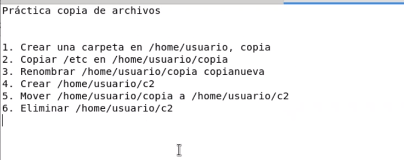
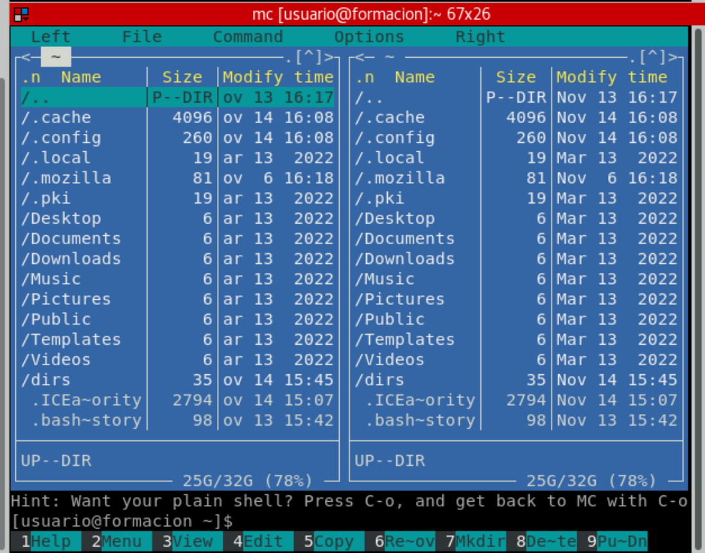
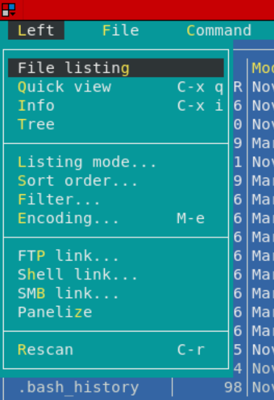
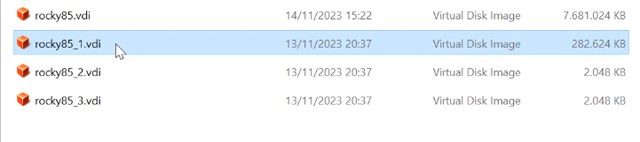

# CLASE 4

install tldr

Para tener un resumen de los comandos menos extenso que man

```bash
[root@formacion ~]# yum install tldr
```

ejemplo de uso

```bash
[root@formacion ~]# tldr ls
```

## mkdir

De base te va a crear un directorio en el directorio actual

```bash
[root@formacion ~]# mkdir directorio
```

Con el -p el mkdir si tu le pones una ruta que no existe te la crea

```bash
[root@formacion ~]# mkdir -p directorio1/directorio2/directorio3
```

```bash
[usuario@formacion home]$ tldr mkdir

  mkdir

  Create directories and set their permissions.
  More information: https://www.gnu.org/software/coreutils/mkdir.

  - Create specific directories:
    mkdir path/to/directory1 path/to/directory2 ...

  - Create specific directories and their [p]arents if needed:
    mkdir -p path/to/directory1 path/to/directory2 ...

  - Create directories with specific permissions:
    mkdir -m rwxrw-r-- path/to/directory1 path/to/directory2 ...
```

hay más si seguimos el link o usamos `man mkdir`

Si encuentro algo y hay un symbolic-link pues sigue el vinculo simbolico que se encuentra establecido

## CP

Copiar

```bash
[usuario@formacion home]$ tldr cp

  cp

  Copy files and directories.
  More information: https://www.gnu.org/software/coreutils/cp.

  - Copy a file to another location:
    cp path/to/source_file.ext path/to/target_file.ext

  - Copy a file into another directory, keeping the filename:
    cp path/to/source_file.ext path/to/target_parent_directory

  - Recursively copy a directory's contents to another location (if the destination exists, the directory is copied inside it):
    cp -r path/to/source_directory path/to/target_directory (./ is the current directory)

  - Copy a directory recursively, in verbose mode (shows files as they are copied):
    cp -vr path/to/source_directory path/to/target_directory

  - Copy multiple files at once to a directory:
    cp -t path/to/destination_directory path/to/file1 path/to/file2 ...

  - Copy text files to another location, in interactive mode (prompts user before overwriting):
    cp -i *.txt path/to/target_directory

  - Follow symbolic links before copying:
    cp -L link path/to/target_directory

  - Use the full path of source files, creating any missing intermediate directories when copying:
    cp --parents source/path/to/file path/to/target_file
```

Con tar o con gzip también permite cómo cp que se pueda almacenar los archivos y los permisos adecuados para cada uno de los archivos copiados.

El cp se puede usar también de forma recursiva:

```bash
[root@formacion ~]# cp -r /etc/ ./
```

En este caso se copiaria la propia carpeta y todos los archivos.

Colocando el asterisco después de instanciar la carpeta que queremos copiar, copiaremos todos los archivos que se encuentran dentro de la carpeta. Pero no la carpeta.

```bash
[root@formacion ~]# cp -r /etc/* ./
```

Copiar tanto archivos ocultos cómo visibles con -ra

```bash
[root@formacion ~]# cp -ra /etc/* ./
```

Copiar con el punto al final, copia el contenido de la carpeta pero no la carpeta. Con archivos ocultos y visibles de una forma segura.

```bash
[root@formacion ~]# cp -raf /etc/. ./
```

Al copiar los vínculos símbolico con una definición absoluta, se recibe la copia al archivo al que apunta el vínculo.

[vínculosimbolico] -> <span style="color:blue;">/etc/authselect/nsswitch.conf</span>

Al copiar los vínculos símbolicos con una definición relativa, normalmente reciben errores.

Por ejemplo si el vinculo:

[vinculosimbolico] -> <span style="color:red;">..usr/share/doc/HTML/index.html</span>

Generalmente al hacer una copia de un archivo a otra carpeta, no puedes ir una carpeta hacia atras y encontraras los mismos archivos y directorios. A menos que hagas esta copia del vínculo relativo a la misma altura de la carpeta o el archivo al que se copia.

## tree

```bash
[usuario@formacion home]$ tldr tree

  tree

  Show the contents of the current directory as a tree.
  More information: http://mama.indstate.edu/users/ice/tree/.

  - Print files and directories up to 'num' levels of depth (where 1 means the current directory):
    tree -L num

  - Print directories only:
    tree -d

  - Print hidden files too with colorization on:
    tree -a -C

  - Print the tree without indentation lines, showing the full path instead (use `-N` to not escape non-printable characters):
    tree -i -f

  - Print the size of each file and the cumulative size of each directory, in human-readable format:
    tree -s -h --du

  - Print files within the tree hierarchy, using a wildcard (glob) pattern, and pruning out directories that don't contain matching files:
    tree -P '*.txt' --prune

  - Print directories within the tree hierarchy, using the wildcard (glob) pattern, and pruning out directories that aren't ancestors of the wanted one:
    tree -P directory_name --matchdirs --prune

  - Print the tree ignoring the given directories:
    tree -I 'directory_name1|directory_name2'

```

## MV

mueve y/o renombra

```bash
[usuario@formacion home]$ tldr mv

  mv

  Move or rename files and directories.
  More information: https://www.gnu.org/software/coreutils/mv.

  - Rename a file or directory when the target is not an existing directory:
    mv path/to/source path/to/target

  - Move a file or directory into an existing directory:
    mv path/to/source path/to/existing_directory

  - Move multiple files into an existing directory, keeping the filenames unchanged:
    mv path/to/source1 path/to/source2 ... path/to/existing_directory

  - Do not prompt for confirmation before overwriting existing files:
    mv -f path/to/source path/to/target

  - Prompt for confirmation before overwriting existing files, regardless of file permissions:
    mv -i path/to/source path/to/target

  - Do not overwrite existing files at the target:
    mv -n path/to/source path/to/target

  - Move files in verbose mode, showing files after they are moved:
    mv -v path/to/source path/to/target
```

## rm/rmdir

```bash

[usuario@formacion ~]$ tldr rm

  rm

  Remove files or directories.
  See also: `rmdir`.
  More information: https://www.gnu.org/software/coreutils/rm.

  - Remove specific files:
    rm path/to/file1 path/to/file2 ...

  - Remove specific files ignoring nonexistent ones:
    rm --force path/to/file1 path/to/file2 ...

  - Remove specific files interactively prompting before each removal:
    rm --interactive path/to/file1 path/to/file2 ...

  - Remove specific files printing info about each removal:
    rm --verbose path/to/file1 path/to/file2 ...

  - Remove specific files and directories recursively:
    rm --recursive path/to/file_or_directory1 path/to/file_or_directory2 ...

[usuario@formacion ~]$ tldr rmdir

  rmdir

  Remove directories without files.
  See also: `rm`.
  More information: https://www.gnu.org/software/coreutils/rmdir.

  - Remove specific directories:
    rmdir path/to/directory1 path/to/directory2 ...

  - Remove specific nested directories recursively:
    rmdir --parents path/to/directory1 path/to/directory2 ...
```

`rm dir3nuevo/fich*` este \* indica que removerá todos los archivos que empiecen por fich

rm sólo remueve ficheros

los rmdir sólo remueve directorios vacios

con `rm -r nombredirectorio` remueve el directorio y todo lo que contiene

Ejemplo:

```bash
[usuario@formacion dirs]$ tree -a
.
├── .bash_logout
├── .bash_profile
├── .bashrc
├── bienvenida
├── cuenta_usuario_creada
└── dir3nuevo
    └── .ficheroculto

1 directory, 6 files
[usuario@formacion dirs]$ rm dir3nuevo
rm: cannot remove 'dir3nuevo': Is a directory
[usuario@formacion dirs]$
[usuario@formacion dirs]$ mkdir dirvacio
[usuario@formacion dirs]$ rm dirvacio
rm: cannot remove 'dirvacio': Is a directory
[usuario@formacion dirs]$

[usuario@formacion dirs]$ rm -r dirvacio
[usuario@formacion dirs]$
[usuario@formacion dirs]$ tree
.
├── bienvenida
├── cuenta_usuario_creada
└── dir3nuevo
```

#### -- rm pregunta al borrar por ficheros que no son del usuario que está borrando

```bash
[usuario@formacion dir]$ pwd
/home/usuario/dirs/dir
[usuario@formacion dir]$ ls -l
total 0
-rw-r--r--. 1 u3      u3      0 Nov 14 15:51 file
-rw-rw-r--. 1 usuario usuario 0 Nov 14 15:51 fileusuario
[usuario@formacion dir]$ cd ..
[usuario@formacion dirs]$ rm -r dir
rm: remove write-protected regular empty file 'dir/file'? n
rm: cannot remove 'dir': Directory not empty
[usuario@formacion dirs]
```

#### -- con -f no pregunta (force)

```bash
[usuario@formacion dirs]$ rm -fr dir
[usuario@formacion dirs]$
[usuario@formacion dirs]$ tree
.
├── bienvenida
└── cuenta_usuario_creada

0 directories, 2 files
```

## ATENCIÓN CON RM -RF y apuntes a la carpeta actual sobretodo si eres el root

_PUEDES LLEGAR A BORRAR TODO EL SISTEMA_

```bash
[root@formacion dirs]# rm -rf ./*
```

EJERCICIO:



# Programa de linux ---- MIDNIGHT COMANDER

MIDNIGHT COMANDER -- mc

Tres formas de instalarlo

```bash
[root@formacion dirs]# yum install mc
```

```bash
[root@formacion dirs]# dnf install mc
```

```bash
[root@formacion dirs]# dnf-3 install mc
```



Se usa mucho para facilitarte moverte por el sistema una forma más sencilla.

Ventana izquierda y ventana derecha

EN la parte inferior teclas de función.
En la parte superior los menús.

En los menús le podemos indicar que queremos ver en el left y en el right.

La forma más correcta de usarlo es usarlo con doble ventana.

Con el tab puedes moverete en ventana.

En ambas partes aparece un tree distinto.

Facilita hacer la copia de archivos de un tree a otro tree de carpetas.



Con f1 ayuda
Con f2 menú
Con f3 ver archivos (lee el archivo y lo muestra)
Con f4 editar
Con f5 copias
Con f6 mueves
Con f7 creas carpetas
Con f8 borras
Con f9 pulldn
Con f10 salir (puede estar asociado con otras combinaciones de teclado)

Este programa se puede usar en una consola real y facilita mucho el trabajo.

Para salir también vale ESC + 0

### Crear Vínculos simbólicos y vínculos duros

Symbolic and hard links We can have the same file in two places using links. There are two types of links:
• Hard links: There will be two entries (or more) to the same file in the filesystem. The content will be written once to disk. Hard links for the same file cannot be created in two different filesystems. Hard links cannot be created for directories.
• Symbolic links: A symbolic link is created pointing to a file or directory in any place in the system.
Both are created using the ln (which stands for link) utility

```bash
[usuario@formacion ~]$ tldr ln

  ln

  Creates links to files and directories.
  More information: https://www.gnu.org/software/coreutils/ln.

  - Create a symbolic link to a file or directory:
    ln -s /path/to/file_or_directory path/to/symlink

  - Overwrite an existing symbolic link to point to a different file:
    ln -sf /path/to/new_file path/to/symlink

  - Create a hard link to a file:
    ln /path/to/file path/to/hardlink

```

Los más habituales son los vínculos simbolicos

```bash
[usuario@formacion ~]$ ln -s /etc/passwd ./


[usuario@formacion ~]$ ll
total 0
drwxr-xr-x. 2 root    root     6 Nov  7 16:19 curso
drwxrwxr-x. 2 usuario usuario 32 Nov  7 19:07 datos
drwxr-xr-x. 2 usuario usuario 31 Nov 13 17:29 Desktop
drwxr-xr-x. 2 usuario usuario 59 Nov  7 15:15 Documents
drwxr-xr-x. 2 usuario usuario  6 Mar 13  2022 Downloads
drwxr-xr-x. 2 usuario usuario  6 Mar 13  2022 Music
lrwxrwxrwx. 1 usuario usuario 11 Nov 14 16:26 passwd -> /etc/passwd
drwxr-xr-x. 2 usuario usuario  6 Mar 13  2022 Pictures
drwxr-xr-x. 2 usuario usuario  6 Mar 13  2022 Public
drwxr-xr-x. 2 usuario usuario  6 Mar 13  2022 Templates
drwxr-xr-x. 2 usuario usuario  6 Mar 13  2022 Videos
```

Ejemplos: comandos

```bash
[usuario@formacion dir1]$ ln -s /home/usuario/datos/passwd ./
[usuario@formacion dir1]$ ln -s /home/usuario/datos/passwd ./p1
[usuario@formacion dir1]$ ln -s ../passwd ./p2
```

Ejemplos: resultado de comandos

```bash
[usuario@formacion dir1]$ ll
total 0
lrwxrwxrwx. 1 usuario usuario 26 Nov 14 16:28 passwd -> /home/usuario/datos/passwd
lrwxrwxrwx. 1 usuario usuario 26 Nov 14 16:29 p1 -> /home/usuario/datos/passwd
lrwxrwxrwx. 1 usuario usuario  9 Nov 14 16:30 p2 -> ../passwd
```

En todos los casos now llevará al mismo fichero.

Cuándo sea un directorio, en linux el vínculo simbólico será una parte de la misma ruta.

## Inodo nodo.i

Los nodos i son representacinoes de archivos.

Con el comando ls -i se puede ver el inodo de un archivo.

```bash
[usuario@formacion dir1]$ ls -i
total 0
  131 passwd  131 p1  131 p2
```

o incorporado con ls -lahi

```bash
[usuario@formacion dir1]$ ls -lahi
total 0
  13134224 lrwxrwxrwx. 1 usuario usuario   26 Nov 14 16:28 passwd -> /home/usuario/datos/passwd
  13134225 lrwxrwxrwx. 1 usuario usuario   26 Nov 14 16:29 p1 -> /home/usuario/datos/passwd
  13134226 lrwxrwxrwx. 1 usuario usuario    9 Nov 14 16:30 p2 -> ../passwd
```

Podemos ver el valor del inodo. O sea el valor numérico del inodo.

El valor numérico antes de la fecha es el valor de bytes que ocupa dentro del OS. En los ficheros es equivalente al contenido que tiene el fichero. En el caso de los inodos el peso equivale a lo largo que es el nombre de la ruta de referencia del inodo.

El número que se encuentra entre los permisos y el usuario/grupo que tienen pprivilegios. En este caso en todos es el número 1.

Este valor es el número de enlaces que tiene el inodo. En este caso todos tienen un enlace.

Los inodos con los vínculos duros tienen el mismo número de inodo. Es el mismo archivo representado varias veces dentro de la jerarquía de archivos. Contienen el mismo contenido y nos indica cuántos inodos hay con el mismo contenido.

La única forma de ver todas las representacionoes de un inodo es con el comando find.

Búscar dónde estan todos las representaciones del mismo inodo:

```bash
[usuario@formacion dir1]$ find /home/usuario/ -inum 13134224
/home/usuario/datos/passwd
/home/usuario/dir1/passwd
/home/usuario/dir1/p1
```

Estos tres archivos si tuvieran el mismo número de inodo se mostrarían al representar el -inum del inodo con el número indicado.

##### Limitación de los vínculos

**Los vínculos simbolicos pueden atravesar sistemas de archivos.**
**Los vínculos duros NO pueden atravesar sistemas de archivos.**

El mismo número de inodos no puede estar en dos sistemas de archivos distintos.

Los vínculos simbolicos pueden apuntar a cualquier parte del sistema de archivos si la estructura de la ruta es la misma en los dos mismos OS.

Entre dos discos distintos (carpetas compartidas como ejemplo)

Un vínculo duro no se podría crear correctamente

Un vínculo simbólico sí se podría crear correctamente

En conclusión la mayoría de veces será mejor usar <span style="color:light-green">vínculos simbolicos.</span>

## SISTEMAS DE ARCHIVOS

La máquina virtual con la que trabajamos, si miramoos el contenido de la máquina virtual podemos ver los discos que tiene.

LINUX los trata como discos verdaderos. Aunqué realmente sean ficheros de virtualbox.

Los ficheros vdi son los que simulan ser discos. Son los discos virtuales.

Si creas discos virtuales en virtualbox de 64gb de crecimiento dinámico. Estos discos no ocupan 64gb desde el inicio sino que se va a ir incrementando a medida que se vayan guardando elementos en el sistema de archivos. Sino que y los formateas con ext4, el sistema de archivos ext4 no va a ocupar 64gb. Sino que va a ocupar lo que realmente ocupe el sistema de archivos.

Sda ---- rocky85.vdi
Sdb ---- rocky85_1.vdi
Sdc ---- rocky85_2.vdi
Sdd ---- rocky85_3.vdi



Discos:

[root@formacion dev]# ls -lah sd\*
brw-rw----. 1 root disk 8, 0 Nov 14 15:07 sda
brw-rw----. 1 root disk 8, 1 Nov 14 15:07 sda1
brw-rw----. 1 root disk 8, 16 Nov 14 15:07 sdb
brw-rw----. 1 root disk 8, 17 Nov 14 15:07 sdb1
brw-rw----. 1 root disk 8, 32 Nov 14 15:07 sdc
brw-rw----. 1 root disk 8, 48 Nov 14 15:07 sdd

Controladora SATA o SCSI

En un ordenador de verdad le conectamos discos en una SATA nos los va a mostrar cómo los tenemos en la máquina virtual.

El sda1 o el sdb1 son las particiones que se han creado en el disco.

Para particionar o formatear discos:

ntfs en windows o xfat

En linux se usan generalmlente:

ext4

### Programas de formateo

fdisk (el que se usará en la clase)

parted

#### fdisk

Cuándo llamamos fdisk primero tenemos que llamar a un disco

Debemos tener mucho cuidado.

Nunca se debe poner w + enter sin estar seguro de lo que se está haciendo.

con m + enter se muestra la ayuda

con p + enter se muestra la tabla de particiones

Cada sector tiene 512 bytes si multiplicamos los sectoes por 512 bytes nos da el tamaño del disco.

```bash
[root@formacion dev]# fdisk sda

Welcome to fdisk (util-linux 2.32.1).
Changes will remain in memory only, until you decide to write them.
Be careful before using the write command.


Command (m for help): p
Disk sda: 32 GiB, 34359738368 bytes, 67108864 sectors
Units: sectors of 1 * 512 = 512 bytes
Sector size (logical/physical): 512 bytes / 512 bytes
I/O size (minimum/optimal): 512 bytes / 512 bytes
Disklabel type: dos
Disk identifier: 0x90314d28

Device Boot Start      End  Sectors Size Id Type
sda1   *     2048 67108863 67106816  32G 83 Linux

Command (m for help):
```

El start empieza al sector 2048 por lo que los primeros 2048 sectores no se pueden usar. Estos primeros sectores serán los que tendrán el motor de arranque del disco, esto pasará en los discos princiaples (dónde esta el cargador de arranque del sistema operativo).

Los sistemas modernos son los que usan arranque UEFI.

El sistema clásico de particionamiento:

4 particiones primarias

1 de las 4 puede ser una partición extendida dónde se pueden crear particiones lógicas adicionales. (cualquier os moderno lo admite)

EN EL LIBRO DE CLASE hay una recomendación de la estructura de carpetas en las particiones del disco.

Configuración del área de intercambio: swap

```bash
[root@formacion dev]# echo "UUID=af791686-6373-4e41-a9de-3afd3e7148db none swap defaults 0 0" >> /etc/fstab
[root@formacion dev]# swapon /dev/sdb1
[root@formacion dev]# free -m
              total        used        free      shared  buff/cache   available
Mem:           3928        1334         351          18        2242        2327
Swap:          8190           0        8190
[root@formacion dev]#
```

`[root@formacion dev]# echo "UUID=af791686-6373-4e41-a9de-3afd3e7148db none swap defaults 0 0" >> /etc/fstab` --- Este comando a metido el texto en la salida standard y lo ha redirigido al fichero fstab que es el fichero que el sistema lee al montar los sistemas de archivos.

Le dice que none os que se use para swap que se use el sistema de montaje xfts en modo defaults

El mem es la ram del ordenador

El swap es el área de intercambio de disco a ram. Cuándo un OS empieza a usar el swap es que no tiene suficiente ram para ejecutar los procesos que tiene en cola.

## CREACIÓN DE SISTEMAS DE ARCHIVOS Y MONTAJES (LWM)
