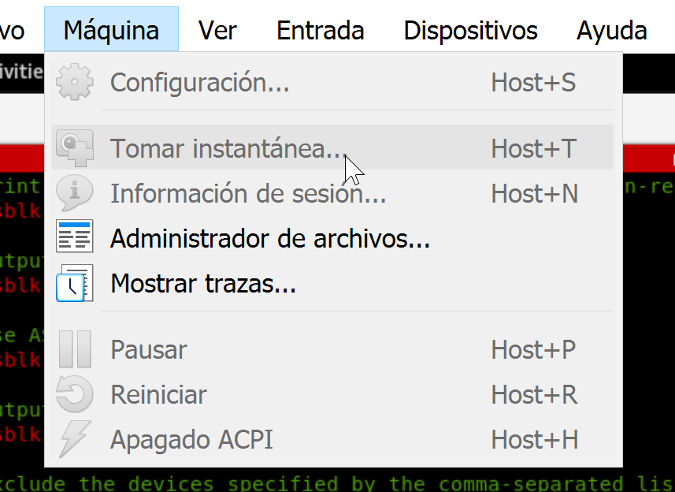
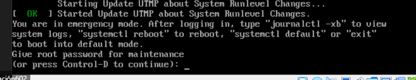
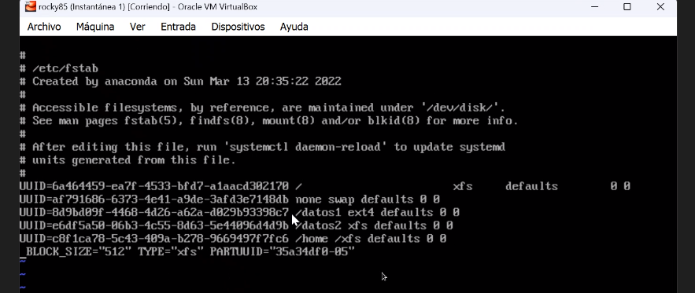
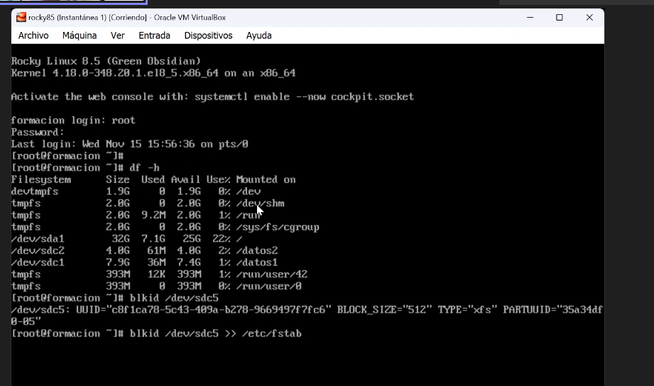
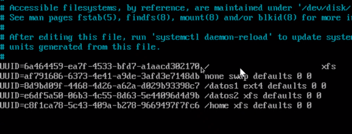
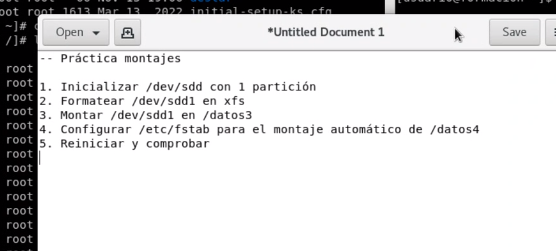
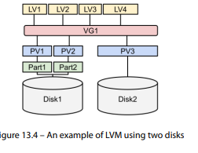
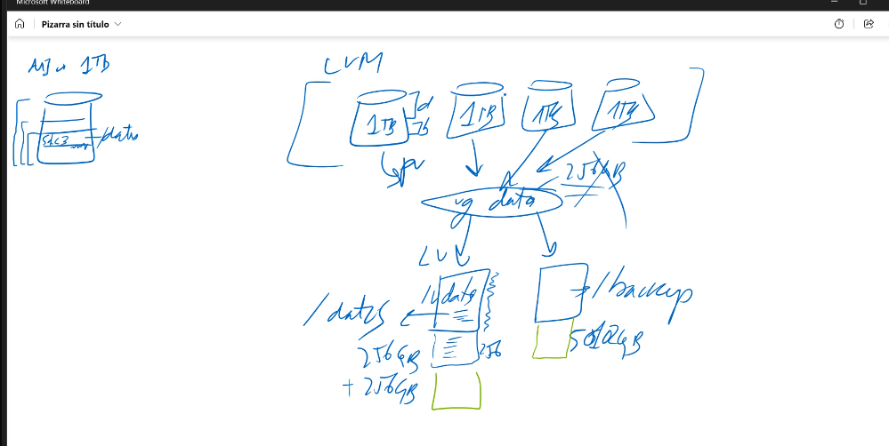
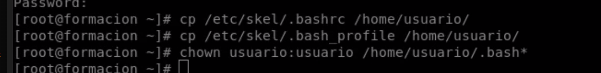

# Clase 5

(Se entró a la clase 30 min tarde)

## Hacer los discos Permanentes

Probar de hacer una edición al fstab pero esto no siempre es lo más recomendable.

En discos SATA puede no dar problemas pero en otros protocolos de montaje si que puede ser peligroso.

## Comandos

#### lsblk

Nos muestra los distintso discos.

```bash
[root@formacion dev]# tldr lsblk

  lsblk

  Lists information about devices.
  More information: https://manned.org/lsblk.

  - List all storage devices in a tree-like format:
    lsblk

  - Also list empty devices:
    lsblk -a

  - Print the SIZE column in bytes rather than in a human-readable format:
    lsblk -b

  - Output info about filesystems:
    lsblk -f

  - Use ASCII characters for tree formatting:
    lsblk -i

  - Output info about block-device topology:
    lsblk -t

  - Exclude the devices specified by the comma-separated list of major device numbers:
    lsblk -e 1,7

  - Display a customized summary using a comma-separated list of columns:
    lsblk --output NAME,SERIAL,MODEL,TRAN,TYPE,SIZE,FSTYPE,MOUNTPOINT
```

Comandos usados:

#### blkid

En el fstab es mejor usar el UUID así les va a preguntar a los dispositivos el blkid del disco y va a montarlos cada inicio en el sitio que le toca y con el nombre que le toca.

sda1 cómo sda1

sdb cómo sdb

```bash
[root@formacion dev]# tldr blkid

  blkid

  Lists all recognized partitions and their Universally Unique Identifier (UUID).
  More information: https://manned.org/blkid.

  - List all partitions:
    sudo blkid

  - List all partitions in a table, including current mountpoints:
    sudo blkid -o list

```

#### Si no se trebaja con entrono gráfico

```bash
[root@formacion dev]# blkid /dev/sdc1 >> /etc/fstab
```

Este comando nos va a dar el UUID del disco y lo va a añadir al fstab.

## Máquina virtual de vbox (instantaneas)

Tomar instantaneas



En la carpeta snapshots se van a crear los archivos de las instantaneas. (replicando los discos que conforman la máquina virtual)

### Modo de emergencia

You are in emergency mode. Sin entorno grafico.



Le das la contraseña del root y te da una línea de comandos.

usamos df -h para ver lo que hay montado.

En /var/log podemos meternos a ver los mensages con un cat messages y nos damos cuenta de que nos ha montado un disco que siempre monta. Por lo que vamos a df -h y vemos que los discos normales no los monta.

El problema está en el fstab.

Ahora tenemos que recordar cómo y qué se monta en el datos. Por lo que vamos a usar el comando

lsblk -f

Para ver si los sistemas de archivos están bien. y los uuid coinciden con los del fstab.

## Montaje permanente de otro disico

```bash

[root@formacion ~]# blkid /dev/sdc2
/dev/sdc2: UUID="1c39e72d-d1c6-41f3-b5f4-8c292eafe538" BLOCK_SIZE="512" TYPE="xfs" PARTUUID="b229a37d-02"
[root@formacion ~]# nano /etc/fstab
[root@formacion etc]# cat fstab

#
# /etc/fstab
# Created by anaconda on Sun Mar 13 20:35:22 2022
#
# Accessible filesystems, by reference, are maintained under '/dev/disk/'.
# See man pages fstab(5), findfs(8), mount(8) and/or blkid(8) for more info.
#
# After editing this file, run 'systemctl daemon-reload' to update systemd
# units generated from this file.
#
UUID=6a464459-ea7f-4533-bfd7-a1aacd302170 /                       xfs     defaults        0 0
UUID=af791686-6373-4e41-a9de-3afd3e7148db none swap defaults 0 0
UUID=6a4960b9-4da1-4ad2-861e-06a785a28c59 /datos1 ext4 defaults 0 0
UUID=1c39e72d-d1c6-41f3-b5f4-8c292eafe538 /datos2 xfs defaults 0 0

[root@formacion ~]# df -h |grep datos
/dev/sdc1       7.9G   36M  7.4G   1% /datos1
[root@formacion ~]# mount /datos2
[root@formacion ~]# df -h
Filesystem      Size  Used Avail Use% Mounted on
devtmpfs        1.9G     0  1.9G   0% /dev
tmpfs           2.0G     0  2.0G   0% /dev/shm
tmpfs           2.0G  9.3M  2.0G   1% /run
tmpfs           2.0G     0  2.0G   0% /sys/fs/cgroup
/dev/sda1        32G  7.0G   26G  22% /
/dev/sdc1       7.9G   36M  7.4G   1% /datos1
tmpfs           393M   24K  393M   1% /run/user/1000
/dev/sr0         51M   51M     0 100% /run/media/usuario/VBox_GAs_7.0.12
/dev/sdc2       4.0G   61M  4.0G   2% /datos2
[root@formacion ~]# df -h |grep /datos
/dev/sdc1       7.9G   36M  7.4G   1% /datos1
/dev/sdc2       4.0G   61M  4.0G   2% /datos2
```

### Llevarnos un directorio de disco y montarlo en otro

Desde el home puede salir más o menos bien

Desde el usr puede tener más problemas y nos podemos cargar el sistema.

Moveremos home.

Mover /home a una partición. Otra carpeta útil de mover es opt que es donde se instalan los programas. También es útil mover /var que es donde se guardan los logs.

##### A continuación se hace la demostración de mover home a una partición

Al hacer eesta acción si los usuarios están logueados no se va a poder hacer o si se puede hacer se van a generar muchos errores.

Los ususarios se conectan al inodo, por lo tanto si tu cambias el inodo al hacer esta acción se van a generar muchos errores y afectación a los usuarios.

1 . Crear el sistema de archivos para el nuevo home

fdisk ---- creando /dev/sdc5

2. Dar formato a la partición

mkfs.xfs /dev/sdc5

3. Carpeta para montar el futuro home

mkdir /home2

_esta carpeta la creamos en la / del root_

_Lo estamos creando realmente en la / del sda1. si montamos el home2 los datos del home inicial no se van a poder acceder aunque no se va a perder la información_

4. Copia de home a home2

_Nos tenemos que asegurar que todo vaya a copiarse igual. Permisos, vinculos simbolico, vinculo duro, etc_ --- investigarlo con anterioridad a la copia

cp -raf /home/\* /home2

5. Comparar home con home2

du -csh /home (cuánto ocupa home)
du -csh /home2 (cuánto ocupa home2)

si los datos son iguales podemos seguir adelante.

ls -lah /home2

Para poder ver los archivos que contiene. SI són los mismos podemos seguir adelante.

Podemos incluso usar : tree

6. Cambio de /home a /home3 y /home2 a /home

_Esto se hace para poder mantener el home original por si algo falla mientras solucionamos los problemas_

mv /home /home3

umount /home2
mkdir /home
mount /dev/sdc5 /home

7. Probamos si está funcionando

Accedemos a un usuario

[root@formacion ~]# su - usuario

y entramos en el home del usuario

(escribimos en un archvio de megas)

Y comporbamos con df -h SI SE ESTA ESCRIBIENDO EN EL DISCO asociado al /home

8. Cambiamos el archivo fstab con el blkid del disco que montamos en el /home

Hacemos un

blkid /dev/sdc5

y luego modificamos el fstab

vi /etc/fstab
nano /etc/fstab

Copiamos el UUID y asignamos los valores necesarios en el fstab



8.1 Cambio definitivo

Un reboot

### si la liamos y no podemos iniciar sesión

ctrl + alt + f2 ---- inicia un terminal y nos podmos conectar cómo root



En el vi fstab // nano fstab




Y luego montar el /home en los comandos

mount /home

9. Luego ya podemos borrar el /home3 (datos antiguos que se encuentran en el disco sda1)

df -h | grep sda1

## Practica

\*\* No existe /datos4 sino que es /datos3



### Solución

++ ya estaba creado el directorio /datos3 sino se crea facilmente con `mkdir /datos3`

```bash
[root@formacion /]# fdisk /dev/sdd

Welcome to fdisk (util-linux 2.32.1).
Changes will remain in memory only, until you decide to write them.
Be careful before using the write command.

Device does not contain a recognized partition table.
Created a new DOS disklabel with disk identifier 0x2816ebbb.

Command (m for help): n
Partition type
   p   primary (0 primary, 0 extended, 4 free)
   e   extended (container for logical partitions)
Select (default p): p
Partition number (1-4, default 1): 1
First sector (2048-67108863, default 2048):
Last sector, +sectors or +size{K,M,G,T,P} (2048-67108863, default 67108863):

Created a new partition 1 of type 'Linux' and of size 32 GiB.

Command (m for help): p
Disk /dev/sdd: 32 GiB, 34359738368 bytes, 67108864 sectors
Units: sectors of 1 * 512 = 512 bytes
Sector size (logical/physical): 512 bytes / 512 bytes
I/O size (minimum/optimal): 512 bytes / 512 bytes
Disklabel type: dos
Disk identifier: 0x2816ebbb

Device     Boot Start      End  Sectors Size Id Type
/dev/sdd1        2048 67108863 67106816  32G 83 Linux

Command (m for help): p
Disk /dev/sdd: 32 GiB, 34359738368 bytes, 67108864 sectors
Units: sectors of 1 * 512 = 512 bytes
Sector size (logical/physical): 512 bytes / 512 bytes
I/O size (minimum/optimal): 512 bytes / 512 bytes
Disklabel type: dos
Disk identifier: 0x2816ebbb

Device     Boot Start      End  Sectors Size Id Type
/dev/sdd1        2048 67108863 67106816  32G 83 Linux

Command (m for help): w
The partition table has been altered.
Calling ioctl() to re-read partition table.
Syncing disks.

[root@formacion /]# ls -lah sd*
ls: cannot access 'sd*': No such file or directory
[root@formacion /]# cd /dev
[root@formacion dev]# ls -lah sd*
brw-rw----. 1 root disk 8,  0 Nov 15 15:52 sda
brw-rw----. 1 root disk 8,  1 Nov 15 15:52 sda1
brw-rw----. 1 root disk 8, 16 Nov 15 15:52 sdb
brw-rw----. 1 root disk 8, 17 Nov 15 15:52 sdb1
brw-rw----. 1 root disk 8, 32 Nov 15 15:52 sdc
brw-rw----. 1 root disk 8, 33 Nov 15 15:52 sdc1
brw-rw----. 1 root disk 8, 34 Nov 15 15:52 sdc2
brw-rw----. 1 root disk 8, 35 Nov 15 15:52 sdc3
brw-rw----. 1 root disk 8, 36 Nov 15 15:52 sdc4
brw-rw----. 1 root disk 8, 37 Nov 15 16:09 sdc5
brw-rw----. 1 root disk 8, 48 Nov 15 16:47 sdd
brw-rw----. 1 root disk 8, 49 Nov 15 16:47 sdd1
[root@formacion dev]# mkfs.xfs /dev/sdd1
meta-data=/dev/sdd1              isize=512    agcount=4, agsize=2097088 blks
         =                       sectsz=512   attr=2, projid32bit=1
         =                       crc=1        finobt=1, sparse=1, rmapbt=0
         =                       reflink=1
data     =                       bsize=4096   blocks=8388352, imaxpct=25
         =                       sunit=0      swidth=0 blks
naming   =version 2              bsize=4096   ascii-ci=0, ftype=1
log      =internal log           bsize=4096   blocks=4095, version=2
         =                       sectsz=512   sunit=0 blks, lazy-count=1
realtime =none                   extsz=4096   blocks=0, rtextents=0
[root@formacion dev]# df -h sd*
Filesystem      Size  Used Avail Use% Mounted on
devtmpfs        1.9G     0  1.9G   0% /dev
/dev/sda1        32G  7.0G   26G  22% /
devtmpfs        1.9G     0  1.9G   0% /dev
devtmpfs        1.9G     0  1.9G   0% /dev
devtmpfs        1.9G     0  1.9G   0% /dev
/dev/sdc1       7.9G   36M  7.4G   1% /datos1
/dev/sdc2       4.0G   61M  4.0G   2% /datos2
devtmpfs        1.9G     0  1.9G   0% /dev
devtmpfs        1.9G     0  1.9G   0% /dev
devtmpfs        1.9G     0  1.9G   0% /dev
devtmpfs        1.9G     0  1.9G   0% /dev
devtmpfs        1.9G     0  1.9G   0% /dev
[root@formacion dev]# ls -lah sd*
brw-rw----. 1 root disk 8,  0 Nov 15 15:52 sda
brw-rw----. 1 root disk 8,  1 Nov 15 15:52 sda1
brw-rw----. 1 root disk 8, 16 Nov 15 15:52 sdb
brw-rw----. 1 root disk 8, 17 Nov 15 15:52 sdb1
brw-rw----. 1 root disk 8, 32 Nov 15 15:52 sdc
brw-rw----. 1 root disk 8, 33 Nov 15 15:52 sdc1
brw-rw----. 1 root disk 8, 34 Nov 15 15:52 sdc2
brw-rw----. 1 root disk 8, 35 Nov 15 15:52 sdc3
brw-rw----. 1 root disk 8, 36 Nov 15 15:52 sdc4
brw-rw----. 1 root disk 8, 37 Nov 15 16:09 sdc5
brw-rw----. 1 root disk 8, 48 Nov 15 16:47 sdd
brw-rw----. 1 root disk 8, 49 Nov 15 16:48 sdd1
[root@formacion dev]# mount /dev/sdd1 /datos3
[root@formacion dev]# cd /
[root@formacion /]# cd /dev
[root@formacion dev]# df -h sd*
Filesystem      Size  Used Avail Use% Mounted on
devtmpfs        1.9G     0  1.9G   0% /dev
/dev/sda1        32G  7.0G   26G  22% /
devtmpfs        1.9G     0  1.9G   0% /dev
devtmpfs        1.9G     0  1.9G   0% /dev
devtmpfs        1.9G     0  1.9G   0% /dev
/dev/sdc1       7.9G   36M  7.4G   1% /datos1
/dev/sdc2       4.0G   61M  4.0G   2% /datos2
devtmpfs        1.9G     0  1.9G   0% /dev
devtmpfs        1.9G     0  1.9G   0% /dev
devtmpfs        1.9G     0  1.9G   0% /dev
devtmpfs        1.9G     0  1.9G   0% /dev
/dev/sdd1        32G  261M   32G   1% /datos3
[root@formacion dev]# blkid /dev/sdd1
/dev/sdd1: UUID="0491daaa-cb62-446e-9bc5-73afa580f1eb" BLOCK_SIZE="512" TYPE="xfs" PARTUUID="2816ebbb-01"
[root@formacion dev]# nano /etc/fstab
[root@formacion dev]# cat fstab
cat: fstab: No such file or directory
[root@formacion dev]# cat /etc/fstab

#
# /etc/fstab
# Created by anaconda on Sun Mar 13 20:35:22 2022
#
# Accessible filesystems, by reference, are maintained under '/dev/disk/'.
# See man pages fstab(5), findfs(8), mount(8) and/or blkid(8) for more info.
#
# After editing this file, run 'systemctl daemon-reload' to update systemd
# units generated from this file.
#
UUID=6a464459-ea7f-4533-bfd7-a1aacd302170 /                       xfs     defaults        0 0
UUID=af791686-6373-4e41-a9de-3afd3e7148db none swap defaults 0 0
UUID=6a4960b9-4da1-4ad2-861e-06a785a28c59 /datos1 ext4 defaults 0 0
UUID=1c39e72d-d1c6-41f3-b5f4-8c292eafe538 /datos2 xfs defaults 0 0
UUID=0491daaa-cb62-446e-9bc5-73afa580f1eb" /datos3 xfs defaults 0 0

[root@formacion dev]# umount /datos3
[root@formacion dev]# mount /datos3
mount: /datos3: can't find UUID=0491daaa-cb62-446e-9bc5-73afa580f1eb".
[root@formacion dev]# nano /etc/fstab
[root@formacion dev]# cat /etc/fstab

#
# /etc/fstab
# Created by anaconda on Sun Mar 13 20:35:22 2022
#
# Accessible filesystems, by reference, are maintained under '/dev/disk/'.
# See man pages fstab(5), findfs(8), mount(8) and/or blkid(8) for more info.
#
# After editing this file, run 'systemctl daemon-reload' to update systemd
# units generated from this file.
#
UUID=6a464459-ea7f-4533-bfd7-a1aacd302170 /                       xfs     defaults        0 0
UUID=af791686-6373-4e41-a9de-3afd3e7148db none swap defaults 0 0
UUID=6a4960b9-4da1-4ad2-861e-06a785a28c59 /datos1 ext4 defaults 0 0
UUID=1c39e72d-d1c6-41f3-b5f4-8c292eafe538 /datos2 xfs defaults 0 0
UUID=0491daaa-cb62-446e-9bc5-73afa580f1eb /datos3 xfs defaults 0 0

[root@formacion dev]# umount /datos3
umount: /datos3: not mounted.
[root@formacion dev]# mount /datos3
[root@formacion dev]# df -h sd*
Filesystem      Size  Used Avail Use% Mounted on
devtmpfs        1.9G     0  1.9G   0% /dev
/dev/sda1        32G  7.0G   26G  22% /
devtmpfs        1.9G     0  1.9G   0% /dev
devtmpfs        1.9G     0  1.9G   0% /dev
devtmpfs        1.9G     0  1.9G   0% /dev
/dev/sdc1       7.9G   36M  7.4G   1% /datos1
/dev/sdc2       4.0G   61M  4.0G   2% /datos2
devtmpfs        1.9G     0  1.9G   0% /dev
devtmpfs        1.9G     0  1.9G   0% /dev
devtmpfs        1.9G     0  1.9G   0% /dev
devtmpfs        1.9G     0  1.9G   0% /dev
/dev/sdd1        32G  261M   32G   1% /datos3

```

El formato del disco fat o el nfts que son muy viejos pueden dar problemas.

Cada disco tiene su lista de inodos indeppendiente. Lo que no permite crear vinculos duros entre discos.

## variable PATH

[root@formacion dev]# echo $PATH
/usr/local/sbin:/usr/local/bin:/usr/sbin:/usr/bin:/root/bin

El Path es el lugar donde se guardan los binarios de los comandos y dónde linux va a buscar los archivos ejecutables. (scripts de inicio en el bin) Eso se usa para tener comandoss que se puedan ejecutar desde cualquier sitio.

/home/usuario/bin

## LVM

Logical Volume Manager

(Aparece en el libro)

Capítulo 13
Página 351

PV - paritición de volumen lógico
VG - grupo de volumen lógico
LV - volumen lógico individual



### Porqué usar LVM?

Porqué en el particionamiento clasico hacer crecer el disco es muy complicado.

Con LVM es más sencillo hacer crecer y decrecer los LV y VG según necesidad.



Con LVM se gana mucho dinamismo para dar discos a los grupos volumenes lógicos(vg) y luego este a los volumenes lógicos individuales(LV).

Los volumenes lógicos individuales necesitan de su formateo para poder ser usados.

### Creación de un LVM

El particionamento de un disco se hace de forma predeterminada con el LVM.

```text

Understanding LVM
LVM uses three layers to manage the storage devices in our systems. These layers are as follows:
• Physical Volumes (PVs): The first layer of LVM. Assigned to the block devices directly. A
physical volume can be either a partition on a disk or a full raw disk itself.
• Volume Groups (VGs): The second layer of LVM. It groups the physical volumes to aggregate
space. This is an intermediate layer and not very visible, but its role is very important.
• Logical Volumes (LVs): The third layer of LVM. It distributes the space that the volume groups
aggregate.
```


```text
Let’s explain this example diagram to understand all the layers:
• We have two disks, which are Disk1 and Disk2 in the diagram.
• Disk1 is partitioned into two partitions, Part1 and Part2.
• Disk2 is not partitioned.
• There are three PVs. The purpose of these is to prepare the disk space to be used in LVM. The
PVs are as follows:
    - PV1, created on the Part1 partition of Disk1
    - PV2, created on the Part2 partition of Disk1
    - PV3, created directly on Disk2
• One single VG, VG1, aggregates all three PVs, PV1, PV2, and PV3. Now, all that disk space is
consolidated and can be easily redistributed.
• To distribute the space, there are four LVs – LV1, LV2, LV3, and LV4. Please note that the
LVs do not use the whole disk. This way, if we need to extend a volume or create a snapshot,
it will be possible.
This is a basic description of how the layers are distributed without diving into complex cases such as
mirroring, thin provisioning, or snapshotting.
As a rule of thumb, we need to understand that PVs are designed to prepare devices to be used by
LVM, VGs to aggregate PVs, and LVs to distribute the aggregated space.
```

Si falla uno de los discos del volumen lógico puede fallar el volumen lógico en conjunto.

No es recomendado hacer el flujo del libro en el que se dan particiones del disco.

Lo recomendado es dar todo el disco.

Usaremos el comando pvcrete

```bash

[root@formacion dev]# tldr pvcreate

  pvcreate

  Initialize a disk or partition for use as a physical volume.
  See also: `lvm`.
  More information: https://man7.org/linux/man-pages/man8/pvcreate.8.html.

  - Initialize the `/dev/sda1` volume for use by LVM:
    pvcreate /dev/sda1

  - Force the creation without any confirmation prompts:
    pvcreate --force /dev/sda1

```

Después de meter los dos discos habrá más sds en dev.

```bash
[root@formacion dev]# pvcreate /dev/sde
  Physical volume "/dev/sde" successfully created.
[root@formacion dev]# pvcreate /dev/sdf
  Physical volume "/dev/sdf" successfully created.
```

usaremos el pvdisplay y el pvs para ver lo que vamos creando

```bash
[root@formacion dev]# pvdisplay /dev/sde
  "/dev/sde" is a new physical volume of "8.00 GiB"
  --- NEW Physical volume ---
  PV Name               /dev/sde
  VG Name
  PV Size               8.00 GiB
  Allocatable           NO
  PE Size               0
  Total PE              0
  Free PE               0
  Allocated PE          0
  PV UUID               rZ7lm7-5740-zCLQ-OFsP-81Cl-uejh-twPdTq

[root@formacion dev]# pvdisplay /dev/sdf
  "/dev/sdf" is a new physical volume of "8.00 GiB"
  --- NEW Physical volume ---
  PV Name               /dev/sdf
  VG Name
  PV Size               8.00 GiB
  Allocatable           NO
  PE Size               0
  Total PE              0
  Free PE               0
  Allocated PE          0
  PV UUID               4057dL-qqIK-9zjN-0WxI-oXQ3-phB5-Yr4Ey5

[root@formacion dev]# pvs
  PV         VG Fmt  Attr PSize PFree
  /dev/sde      lvm2 ---  8.00g 8.00g
  /dev/sdf      lvm2 ---  8.00g 8.00g

```

Ahora creamos el volumen físico.

```bash
[root@formacion dev]# tldr vgs

  vgs

  Display information about volume groups.
  See also: `lvm`.
  More information: https://man7.org/linux/man-pages/man8/vgs.8.html.

  - Display information about volume groups:
    vgs

  - Display all volume groups:
    vgs -a

  - Change default display to show more details:
    vgs -v

  - Display only specific fields:
    vgs -o field_name_1,field_name_2

  - Append field to default display:
    vgs -o +field_name

  - Suppress heading line:
    vgs --noheadings

  - Use separator to separate fields:
    vgs --separator =

```

vgcreate

```bash
[root@formacion dev]# tldr vgcreate

  vgcreate

  Create volume groups combining multiple mass-storage devices.
  See also: `lvm`.
  More information: https://man7.org/linux/man-pages/man8/vgcreate.8.html.

  - Create a new volume group called vg1 using the `/dev/sda1` device:
    vgcreate vg1 /dev/sda1

  - Create a new volume group called vg1 using multiple devices:
    vgcreate vg1 /dev/sda1 /dev/sdb1 /dev/sdc1
```

#### Crear LV

lvcreate

```bash
[root@formacion dev]# tldr lvs

  lvs

  Display information about logical volumes.
  See also: `lvm`.
  More information: https://man7.org/linux/man-pages/man8/lvs.8.html.

  - Display information about logical volumes:
    lvs

  - Display all logical volumes:
    lvs -a

  - Change default display to show more details:
    lvs -v

  - Display only specific fields:
    lvs -o field_name_1,field_name_2

  - Append field to default display:
    lvs -o +field_name

  - Suppress heading line:
    lvs --noheadings

  - Use a separator to separate fields:
    lvs --separator =
```

```bash
[root@formacion dev]# tldr lvcreate

  lvcreate

  Create a logical volume in an existing volume group. A volume group is a collection of logical and physical volumes.
  See also: `lvm`.
  More information: https://man7.org/linux/man-pages/man8/lvcreate.8.html.

  - Create a logical volume of 10 gigabytes in the volume group vg1:
    lvcreate -L 10G vg1

  - Create a 1500 megabyte linear logical volume named mylv in the volume group vg1:
    lvcreate -L 1500 -n mylv vg1

  - Create a logical volume called mylv that uses 60% of the total space in volume group vg1:
    lvcreate -l 60%VG -n mylv vg1

  - Create a logical volume called mylv that uses all the unallocated space in the volume group vg1:
    lvcreate -l 100%FREE -n mylv vg1

```

#### Resultado de la creación del VG

```bash
[root@formacion dev]# cd vg_datos
[root@formacion vg_datos]# ls
lv_opt
[root@formacion vg_datos]# ls -lah
total 0
drwxr-xr-x.  2 root root   60 Nov 15 18:47 .
drwxr-xr-x. 20 root root 3.4K Nov 15 18:47 ..
lrwxrwxrwx.  1 root root    7 Nov 15 18:47 lv_opt -> ../dm-0
[root@formacion vg_datos]# cd /dev
[root@formacion dev]# cd /mapper
-bash: cd: /mapper: No such file or directory
[root@formacion dev]# cd mapper
[root@formacion mapper]# ls
control  vg_datos-lv_opt
[root@formacion mapper]#

```

dm-0 aparece en dev

Y será asignado con la controladora 253 y no la 8 (sata).

Para ver cómo formatear esta partición podemos usar tres formas de nombrar el disco.

```bash

-- mkfs.xfs /dev/vg_datos/lv_opt
-- mkfs.xfs /dev/mapper/vg_datos-lv_opt
-- mkfs.xfs /dev/dm-0

mkfs.xfs /dev/vg_datos/lv_opt
```

```bash
[root@formacion dev]# mkfs.xfs /dev/vg_datos/lv_opt
meta-data=/dev/vg_datos/lv_opt   isize=512    agcount=4, agsize=65536 blks
         =                       sectsz=512   attr=2, projid32bit=1
         =                       crc=1        finobt=1, sparse=1, rmapbt=0
         =                       reflink=1
data     =                       bsize=4096   blocks=262144, imaxpct=25
         =                       sunit=0      swidth=0 blks
naming   =version 2              bsize=4096   ascii-ci=0, ftype=1
log      =internal log           bsize=4096   blocks=2560, version=2
         =                       sectsz=512   sunit=0 blks, lazy-count=1
realtime =none                   extsz=4096   blocks=0, rtextents=0
[root@formacion dev]#
```

Montar el disco LV

```bash
[root@formacion dev]# mount /dev/vg_datos/lv_opt /opt2
[root@formacion dev]# df -h
Filesystem                   Size  Used Avail Use% Mounted on
devtmpfs                     1.9G     0  1.9G   0% /dev
tmpfs                        2.0G     0  2.0G   0% /dev/shm
tmpfs                        2.0G  9.3M  2.0G   1% /run
tmpfs                        2.0G     0  2.0G   0% /sys/fs/cgroup
/dev/sda1                     32G  7.0G   26G  22% /
/dev/sdd1                     32G  261M   32G   1% /datos3
/dev/sdc2                    4.0G   61M  4.0G   2% /datos2
/dev/sdc1                    7.9G   36M  7.4G   1% /datos1
tmpfs                        393M   28K  393M   1% /run/user/1000
/dev/sr0                      51M   51M     0 100% /run/media/usuario/VBox_GAs_7.0.12
/dev/mapper/vg_datos-lv_opt 1014M   40M  975M   4% /opt2

```

--AUTOMONTAJE en fstab del LV

```bash
[root@formacion opt]# blkid /dev/vg_datos/lv_opt
/dev/vg_datos/lv_opt: UUID="793a01b2-24e9-4bb0-b348-74f00b210cf0" BLOCK_SIZE="512" TYPE="xfs"
[root@formacion opt]# nano /etc/fstab
[root@formacion opt]# cat /etc/fstab

#
# /etc/fstab
# Created by anaconda on Sun Mar 13 20:35:22 2022
#
# Accessible filesystems, by reference, are maintained under '/dev/disk/'.
# See man pages fstab(5), findfs(8), mount(8) and/or blkid(8) for more info.
#
# After editing this file, run 'systemctl daemon-reload' to update systemd
# units generated from this file.
#
UUID=6a464459-ea7f-4533-bfd7-a1aacd302170 /                       xfs     defaults        0 0
UUID=af791686-6373-4e41-a9de-3afd3e7148db none swap defaults 0 0
UUID=6a4960b9-4da1-4ad2-861e-06a785a28c59 /datos1 ext4 defaults 0 0
UUID=1c39e72d-d1c6-41f3-b5f4-8c292eafe538 /datos2 xfs defaults 0 0
UUID=0491daaa-cb62-446e-9bc5-73afa580f1eb /datos3 xfs defaults 0 0
UUID=793a01b2-24e9-4bb0-b348-74f00b210cf0 /opt2 xfs defaults 0 0
```

###### pvscan

Sirve para escanear lo que esta en uso o no de los discos y grupos de volumenes.

```bash
[root@formacion opt]# vgs
  VG       #PV #LV #SN Attr   VSize  VFree
  vg_datos   2   1   0 wz--n- 15.99g 14.99g
[root@formacion opt]# pvscan
  PV /dev/sde   VG vg_datos        lvm2 [<8.00 GiB / <7.00 GiB free]
  PV /dev/sdf   VG vg_datos        lvm2 [<8.00 GiB / <8.00 GiB free]
  Total: 2 [15.99 GiB] / in use: 2 [15.99 GiB] / in no VG: 0 [0   ]

```

##### Añadir espacio al VG grupo de volumenes con lvextend

```bash
[root@formacion opt]# tldr lvextend

  lvextend

  Increase the size of a logical volume.
  See also: `lvm`.
  More information: https://man7.org/linux/man-pages/man8/lvextend.8.html.

  - Increase a volume's size to 120 GB:
    lvextend --size 120G logical_volume

  - Increase a volume's size by 40 GB as well as the underlying filesystem:
    lvextend --size +40G -r logical_volume

  - Increase a volume's size to 100% of the free physical volume space:
    lvextend --size 100%FREE logical_volume
```

```bash
[root@formacion opt]# lvextend -l +512 /dev/vg_datos/lv_opt
  Size of logical volume vg_datos/lv_opt changed from 1.00 GiB (256 extents) to 3.00 GiB (768 extents).
  Logical volume vg_datos/lv_opt successfully resized.

```

Los PE serían cómo los sectores del discoduro Sata

```texto
-- "Extender 2 GB = 2048 MB"
-- "Necesito 512 PE * (4MB) = 2048 MB"
```

```bash

lvextend -l +512 /dev/vg_datos/lv_opt
```

El espacio esta asignado pero el sistemad e archivos no lo reconoce aún.

Con un formato ext3/3xt4
resize2fs /dev/nombredispositivo

```bash
resize2fs /dev/vg_datos/lv_opt

```

Con un formato xfs
xfs_growfs -d /dev/nombredispositivo

```bash
xfs_growfs -d /dev/vg_datos/lv_opt
```

Los nvme seran los discos xv no los sd

//todo lo que mandas al /dev/null se va a borrar.

## SI perdemos alguno de los archivos de configuración

Seguramente podremos hacer una copia desde el skel al /home/usuario/ que ha perdido los archivos



bashsrc
bash_profile
.
.
.
